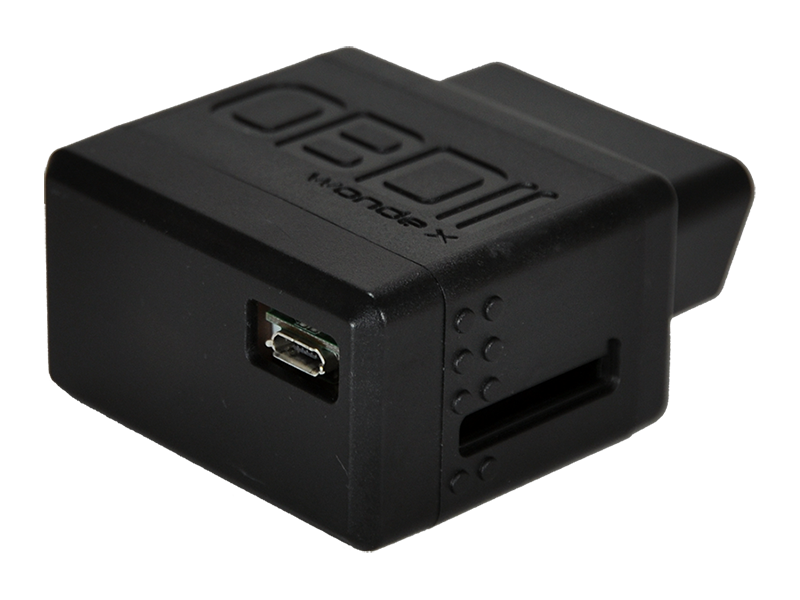

# WP - OT-10

The WP OT-10 is a compact vehicle tracker designed for in vehicle use with OBDII connectivity and dual mode GPS plus GLONASS satellite positioning. It emphasizes discreet installation and continuous location reporting, and includes configurable reporting behaviors such as interval based logging, event driven alerts, and an extensive set of self defined event types for common vehicle conditions. The OT-10 is built to support cellular communication methods and on device configuration to suit a range of tracking scenarios.

As a Plaspy compatible device, the OT-10 can feed location, status updates, and defined event reports into the Plaspy platform for real time visibility and historical review. Its configurable tracking and reporting options make it a practical choice for organizations that want to combine reliable device level features with Plaspy tools for fleet monitoring, alerting, and operations oversight.

## Key Highlights

- Compact 45 x 50 x 28 mm form factor that allows discreet in vehicle placement
- Dual satellite positioning with GPS and GLONASS plus AGPS support for faster fixes
- OBDII connection for vehicle data and odometer or fuel related calculations
- Support for CS Data, SMS, and cellular data reporting for flexible communication
- Configurable tracking rules and up to 100 user defined events for tailored alerts
- Low power draw in sleep mode and support for remote configuration and updates

## How It Works with Plaspy

When connected to Plaspy the WP OT-10 transmits location and event data that Plaspy ingests for live monitoring, reporting, and alerting. The device level settings let administrators choose which events and intervals are reported so Plaspy receives only the data needed for specific workflows.

- Live position updates visible on Plaspy maps for operational awareness
- Event based alerts for geofence, towing, idling, power loss, and speeding sent into Plaspy workflows
- Historical route playback and trip logs for compliance and review
- Fleet level dashboards and reports that aggregate OT-10 telemetry for insight
- OBDII sourced vehicle metrics and odometer or fuel calculations available for monitoring when enabled

## Typical Use Cases

- Fleet vehicle tracking and route oversight for delivery or service fleets
- Security monitoring and recovery support for valuable vehicles
- Usage based reporting for rentals and shared vehicle programs
- Driver behavior and idling monitoring to control operating costs
- Remote asset visibility when vehicles are in transit or parked

## Why Choose This Tracker with Plaspy

The OT-10 combines compact packaging and a broad set of configurable reporting options which makes it a versatile choice for organizations that need dependable vehicle tracking with vehicle level data. Its OBDII interface and event customization let fleet managers tailor the device to common operational needs while keeping installation and device footprint minimal.

Paired with Plaspy, the OT-10 becomes part of a managed monitoring and reporting environment where live location, alerts, and historical data can be used for routing, compliance, and operational optimization. If you need a device that provides flexible reporting and integrates into an established fleet platform, the OT-10 is a practical option to consider.

To learn more about how Plaspy supports devices like the WP OT-10 visit https://www.plaspy.com. Product specifications, availability, and manufacturer details can change over time so please verify current specifications on the manufacturer site http://www.wondeproud.com/.
