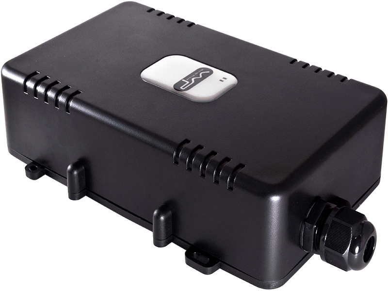

# WP - TT-1

The TT-1 by WP is a high-performance and reliable GPS/GSM/GPRS trailer tracking device designed for asset and fleet management. Building upon the features of the VT10/VT200 models, the TT-1 offers diversified location-based services with its high sensitivity GPS, long operation time, and consideration for outdoor operating environments. With its compact dimensions of 190mm x 115mm x 50mm, the TT-1 is designed to be easily installed and concealed on trailers or other assets.

One of the standout features of the TT-1 is its advanced tracking capabilities. It offers multiple tracking modes, including time interval mode, distance interval mode, smart mode \(combining time, distance, and ignition conditions\), and idle tracking mode. This allows users to customize the tracking settings based on their specific needs. The TT-1 also supports geo-fencing control, roaming control, and provides mileage, battery level, idling, and emergency alarm reports. Additionally, it features superior power management, with a back-up battery life of up to 60 days in the VT200 model and 90 days in the VT10 model.

The TT-1 is equipped with a range of hardware specifications to ensure reliable and accurate tracking. It features a high sensitivity GPS with 66 channels and -165dBm sensitivity, as well as GSM support for 850/900/1800/1900 MHz frequencies. The device is powered by a DC 8-35V power source and includes a 10.4Ah, 3.7V rechargeable lithium battery as a back-up power option. With its IP65 waterproof enclosure and operating temperature range of -20°C to +55°C, the TT-1 is designed to withstand harsh outdoor conditions.

Overall, the TT-1 is a versatile and robust GPS tracker that offers advanced tracking features, long battery life, and reliable performance. It is an ideal choice for businesses and individuals looking to effectively manage their assets and fleets.

