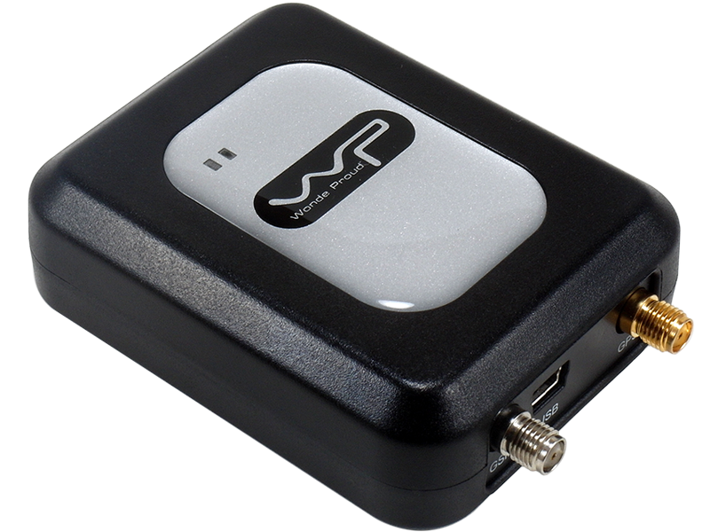

# WP - VT-10

The VT10 High Performance High Sensitivity GPS Vehicle Tracking Device by WP is a smart and reliable GPS/GSM/GPRS device designed for real-time tracking and monitoring of vehicles. With its superior sensitivity GPS module, the VT10 can easily obtain a fix even in urban canyon conditions, making it the perfect choice for location-based requirements. Whether you need to enhance vehicle security or manage your assets and fleet, the VT10 is a versatile solution that can meet your needs.

One of the standout features of the VT10 is its ability to track vehicles by time interval, distance interval, or smart mode. It also offers journey logging with storage capacity for over 100,000 waypoints, allowing you to keep a detailed record of your vehicle's movements. The device provides various reports, including geo-fencing, mileage, self-defined events, and emergency alerts, ensuring that you have comprehensive information about your vehicle's activities. Additionally, the VT10 offers features such as speeding and towing alerts, power low/lost alerts, and power management capabilities.

The VT10 is equipped with a high sensitivity GPS receiver with 20 channels or above, ensuring accurate and reliable positioning. It supports GSM 850/900/1800/1900 MHz frequencies for communication via SMS, GPRS, UDP, and TCP. The device can be powered by a DC source ranging from 8-35V and includes a backup battery with a capacity of 950mA. With its compact dimensions of 60\(W\) x 27\(H\) x 77\(D\) mm and a weight of 110g, the VT10 is easy to install and conceal.

Overall, the VT10 High Performance High Sensitivity GPS Vehicle Tracking Device is a feature-rich and reliable solution for vehicle tracking and monitoring. Its advanced capabilities, including tracking options, comprehensive reporting, and power management, make it an ideal choice for vehicle security, asset management, and fleet tracking applications.

