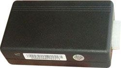

# Xexun - TK-101

The Xexun TK-101 is a compact GPS tracker that uses GPS positioning together with GSM GPRS reporting to provide location updates and remote monitoring. It can report latitude and longitude coordinates for display on mapping tools and supports reporting by SMS or data, making it suitable for tracking vehicles and mobile assets. Key features include auto reporting of position, sending the last known location when GPS coverage is unavailable, SOS monitoring, and configurable security settings such as username and password management.

As a Plaspy compatible device, the TK-101 can feed its location and alert data into Plaspy for centralized visibility and operational oversight. Plaspy can ingest the tracker reports to display positions on maps, trigger geofence and movement alerts, and include TK-101 events in routine reporting. For organizations that need simple, reliable position updates and basic alerting, the TK-101 is a practical choice to pair with Plaspy for asset tracking and fleet monitoring.

## Key Highlights

- Provides real time location reports using GPS with GSM GPRS reporting options.
- Auto reporting keeps frequent position updates available for monitoring.
- Sends last known location automatically if GPS signal is lost.
- Built in SOS and monitoring features enable rapid alerting for emergencies.
- Geofencing support with alerts when a defined area is breached.
- Configurable user credentials and low battery or unauthorized movement alerts.

## How It Works with Plaspy

When integrated with Plaspy, the TK-101's position updates and alerts become part of a single monitoring workflow that teams can use to track and manage assets. Plaspy receives the device messages and translates them into map positions, events, and notifications for operators.

- View live and recent TK-101 positions on Plaspy maps for situational awareness.
- Receive geofence breach and movement alerts from the tracker through Plaspy notification channels.
- Log auto reported positions for playback and route review in Plaspy reporting tools.
- Surface SOS and monitoring events in Plaspy dashboards so responders can act quickly.
- Monitor low battery, unauthorized startup, or theft alerts centrally alongside other fleet data.

## Typical Use Cases

- Managing rental vehicle location and condition reporting.
- Monitoring outdoor equipment or movable assets on worksites.
- Tracking personal vehicles, cargo, or high value items.
- Keeping tabs on family safety items such as cars, pets, or portable devices.
- Adding basic theft alerting and movement notifications for small fleets.

## Why Choose This Tracker with Plaspy

The TK-101 is well suited for organizations looking for straightforward location reporting and essential alerting features. Its support for regular auto reporting and last known location handling helps maintain visibility even when coverage is intermittent, and its SOS and geofence capabilities provide useful operational controls for safety and asset protection. Paired with Plaspy, the tracker becomes part of a managed monitoring solution that centralizes events, simplifies alerting, and supports routine location reporting.

If you want to learn more about using Plaspy with the Xexun TK-101, visit the Plaspy website at https://www.plaspy.com to explore platform features and compatibility options. Product specifications, availability, and manufacturer details can change over time, so please verify current technical and support information with the official manufacturer documentation at https://www.xexun.com/.
