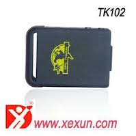

# Xexun - TK-102

The Xexun TK-102 is a compact and versatile GPS tracker designed for reliable location monitoring and data recording. It includes an SD card slot for saving GPRS data locally, a larger battery for extended operating time, and an ARM7 processor to support steady device operation. The unit offers a mix of live tracking features and onboard storage, along with a variety of alerts such as geo-fence, movement, overspeed, low battery, and an SOS button.

As a Plaspy compatible device, the TK-102 can feed position updates and alert events into a centralized fleet and asset management workflow. Its ability to record GPS standpoints to local memory provides an additional layer of data continuity, while real-time polling, auto-track by SMS, and voice surveillance features make it a practical option for organizations that want to combine local device capabilities with Plaspy platform visibility and reporting.

## Key Highlights

- Onboard SD card slot for local backup of GPRS tracking data
- Larger battery for longer deployment between recharges
- ARM7 processor for stable device performance in field use
- Multiple alert types including geo-fence, movement, overspeed, low battery, and SOS
- Supports non server based location modes and recording of GPS standpoints
- Access control with authorization of up to five preset phone numbers

## How It Works with Plaspy

When used with Plaspy, the TK-102 provides location updates and alert notifications that can be viewed and managed alongside other tracked devices. Plaspy can consolidate the device data into dashboards, reports, and operational workflows while allowing teams to act on events such as geo-fence breaches or SOS alerts.

- Centralized location history and playback for trips recorded live or uploaded from the device
- Real time alerts and notifications surfaced in Plaspy for operational response
- Fleet overview and status monitoring to see device activity and battery conditions
- Reporting and exportable event logs for compliance and review
- Local SD card recordings act as a backup source for periods of limited connectivity

## Typical Use Cases

- Vehicle fleet tracking for small to medium sized operations
- Monitoring rental or shared vehicles where local data backup is helpful
- Personal safety and lone worker location monitoring with SOS support
- Tracking portable equipment and assets that may experience intermittent connectivity
- Remote site monitoring where recorded GPS standpoints are needed for later review

## Why Choose This Tracker with Plaspy

The TK-102 is a practical choice for organizations that value a balance of live tracking and local data resilience. Its SD card backup capability reduces the risk of data loss during connectivity gaps, while the extended battery life supports longer deployments between maintenance. Combined with a broad set of alert options, the device can help operations maintain situational awareness and respond to incidents more quickly.

Paired with Plaspy, the TK-102 becomes part of a centralized monitoring and reporting solution. Plaspy brings the device data into a unified view for dispatching, compliance, and operational analysis, making the TK-102 suitable for teams that need straightforward device behavior and dependable record keeping.

To learn more about how the TK-102 can work within Plaspy, visit https://www.plaspy.com. Please note that product specifications, availability, and manufacturer details can change over time; verify the current technical specifications and documentation with the official manufacturer at https://www.xexun.com/.
