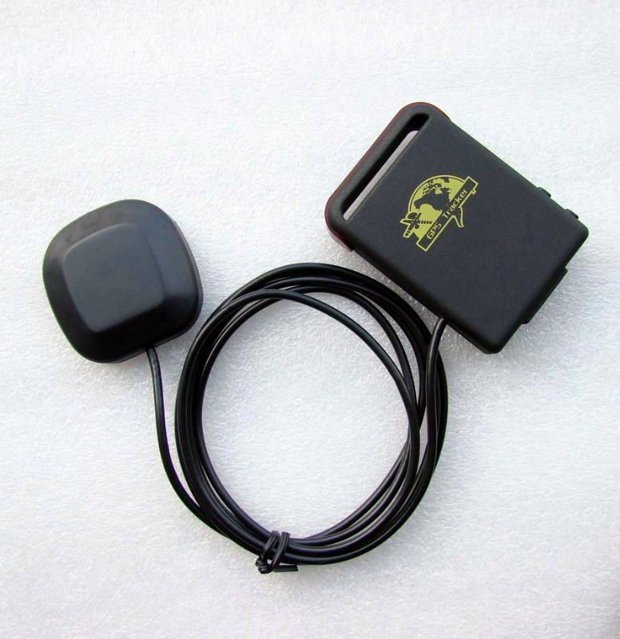

# Xexun - TK-102-2

The Xexun TK-102-2 is an upgraded version of the popular TK102 GPS tracker. With the addition of an SD card slot and a larger battery, this tracker offers enhanced functionality and longer battery life. The TK102-2 is equipped with an ARM7 processor, ensuring fast and efficient performance.

One of the standout features of the TK102-2 is its support for non-server based location tracking. This means that you can track the device's location without the need for a dedicated server. The tracker also has an SD card slot, allowing you to save GPS standpoints directly onto the card. This can be useful for recording and analyzing tracking data.

The TK102-2 offers a range of advanced tracking features, including real-time polling, auto-track by SMS, and voice surveillance. You can authorize or delete up to 5 preset phone numbers, allowing you to control who has access to the tracker's location information. The tracker also supports geo-fence alerts, movement alerts, overspeed alerts, and low battery alerts, ensuring that you are always aware of any unusual activity or potential issues.

With its compact design and powerful features, the Xexun TK-102-2 is an excellent choice for personal or vehicle tracking. Whether you need to keep an eye on your loved ones, monitor the location of your assets, or track the movements of your fleet, this GPS tracker offers the reliability and functionality you need.

### Key Features:

- SD card slot for saving GPS standpoints
- Support for non-server based location tracking
- Authorize/delete up to 5 preset phone numbers
- Real-time polling
- Auto-track by SMS
- Voice surveillance
- Geo-fence alert
- Movement alert
- Overspeed alert
- IMEI checking
- SOS button
- Low battery alert
- Hidden number tracking
- SMS center
- GSM ID
- Motion sensor
- Mobile tracking
- Tlimit function

