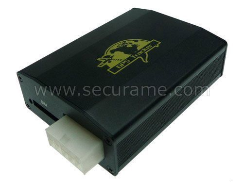

# Xexun - TK-103

The Xexun TK-103 GPS tracker is a versatile device that can be used in various applications, including private car and vehicle leasing industry, outdoor mechanical equipment anti-theft tracking, and corporate vehicle management monitoring. With its wide range of features, this tracker provides real-time location tracking and monitoring capabilities to ensure the safety and security of your assets.

One of the standout features of the TK-103 is its immediate inquiry location function, which allows you to quickly and easily locate your vehicle or equipment. Additionally, the tracker offers regularly scheduled time tracking, address SMS inquiries, and GPS tracking blind capabilities. It also utilizes GSM base station location technology for accurate positioning.

The TK-103 offers a range of alarm features, including shift alarm, speed alarm, low battery alarm, vibration alarm, SOS emergency alarm, GPS antenna cut off alarm, external power supply cut off alarm, and illegal fire alarm. These alarms help to alert you to any potential issues or threats to your assets.

Other notable features of the TK-103 include historical track playback, electronic fence functionality, remote upgrade capability, remote monitoring, dual SIM card support for automatic network switching, and the option for an SD card for additional storage. There is also an optional feature for remote power off the oil, providing an added layer of control over your assets.

