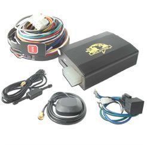

# Xexun - TK-103-2

The Xexun TK-103-2 is a versatile GPS tracker designed for a range of vehicle and asset monitoring applications. It is commonly used in private cars, vehicle leasing operations, outdoor mechanical equipment anti theft tracking, and corporate vehicle management. The device provides location reporting, scheduled tracking, and a comprehensive set of alarm features intended to help protect and monitor movable assets.

As a device compatible with Plaspy, the TK-103-2 can feed its tracking data and event notifications into the Plaspy platform for consolidated visibility and operational oversight. Plaspy can display live locations, manage alerts, and retain historical tracks from devices like the TK-103-2 so teams can monitor fleets and equipment from a single interface.

## Key Highlights

- Real time tracking and immediate location inquiry for on demand position checks
- Scheduled time tracking to report locations at configurable intervals
- Broad alarm set including SOS emergency, speed alarm, vibration alarm, and power related alerts
- Historical track playback and electronic fence support for review and perimeter monitoring
- Remote monitoring and remote upgrade capabilities to manage devices without physical access
- Dual SIM automatic network switching and optional SD storage for extended data retention
- Optional remote power off the oil function to assist in recovery and immobilization scenarios

## How It Works with Plaspy

When connected to Plaspy the TK-103-2 sends its location and event data to the platform where it becomes part of your fleet or asset dashboard. Plaspy organizes incoming positions and alarms so teams can act on them and review device history.

- View live device positions and movement on Plaspy maps for immediate situational awareness
- Receive and manage alarms from the device inside Plaspy, including SOS, speed, vibration, and power cut notifications
- Use scheduled position reports to build a continuous breadcrumb trail and support routine monitoring
- Play back historical tracks within Plaspy to investigate routes and past movements
- Configure electronic fences in Plaspy and handle fence enter and exit events triggered by the tracker
- Monitor device status and apply remote management actions where supported, such as remote upgrades

## Typical Use Cases

- Private vehicle tracking for owner safety and location verification
- Vehicle leasing and rental fleet management to monitor asset usage and location
- Anti theft tracking for outdoor mechanical equipment and mobile machinery
- Corporate fleet oversight for route monitoring and operational coordination
- Emergency response and recovery workflows using SOS and immobilization features

## Why Choose This Tracker with Plaspy

The TK-103-2 pairs practical tracking and alarm features with Plaspy's platform capabilities to deliver a useful solution for organizations that need straightforward location visibility and event handling. Its mix of scheduled reporting, immediate inquiry, and alarm options makes it suitable for fleet managers and asset custodians who require timely alerts and historical review.

Plaspy helps centralize device data from trackers such as the TK-103-2 so teams can reduce manual monitoring and improve response times. While the TK-103-2 offers a broad set of features, consider your specific operational needs and confirm that the available alarms and optional extras match your requirements.

To learn more about how the TK-103-2 can work with Plaspy, visit the Plaspy website at https://www.plaspy.com. Product specifications and manufacturer details can change over time, so please verify current capabilities and availability on the official Xexun site at https://www.xexun.com/.
