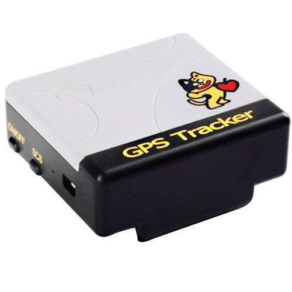

# Xexun - TK-201

The Xexun TK201 is a compact and versatile personal GPS tracker designed for on person use. Its small form factor makes it easy to carry or wear, which suits monitoring children, older adults, or pets. The device offers real time location reporting, voice surveillance, track playback, and a set of configurable alerts to support safety and situational awareness.

As a Plaspy compatible device, the TK201 can feed location updates and alert events into the Plaspy platform so those updates are visible alongside other tracked assets. That compatibility makes the TK201 a practical option for individuals and organizations that want a small personal tracker managed within the same Plaspy account used for wider monitoring and reporting.

## Key Highlights

- Compact personal tracker suitable for carrying or wearing by people and pets
- Real time tracking capability for ongoing location visibility
- Voice surveillance feature to check the surrounding environment when needed
- Ability to report last known location even in areas with limited GPS coverage
- Track playback for reviewing historical movement and routes
- Multiple alert types including geofence, movement, overspeed, low power, and SOS
- Up to 48 hour battery life for extended monitoring between charges

## How It Works with Plaspy

When used with Plaspy, the TK201's location updates and alert reports are presented within the Plaspy dashboard to provide unified visibility and oversight. Plaspy can display positions on maps, log alerts, and maintain movement history for review and reporting.

- Map view showing live and historical positions reported by the device
- Timeline and playback controls for reviewing movement history recorded by the tracker
- Alert logging and configurable notifications for events like geofence breaches or SOS
- Consolidation of TK201 data with other tracked devices for unified operational monitoring
- Reporting tools to export or analyze device activity over selected time ranges

## Typical Use Cases

- Personal safety tracking for children and elderly family members
- Pet tracking for animals that can carry a small device
- Solo workers or personnel who benefit from location awareness and SOS alerts
- Short term rentals or temporary asset monitoring where discreet tracking is needed
- Small scale fleet or group monitoring when mixed with other Plaspy managed devices

## Why Choose This Tracker with Plaspy

The TK201 is a practical choice for situations that prioritize compact size and essential tracking features. Its combination of real time location, alerting options, and playback capability makes it useful for both personal safety and light operational monitoring. Integrating the TK201 into Plaspy lets you manage the device alongside other assets, simplifying oversight and reducing the need for separate tracking systems.

Because available public information for small trackers is often concise, the TK201 is presented here with an emphasis on features that users commonly rely on. If you need a small wearable tracker that plugs into a wider monitoring workflow, the TK201 paired with Plaspy provides a straightforward, visible solution.

To learn more about how Plaspy supports devices like the TK201 visit https://www.plaspy.com. Product specifications, availability, and manufacturer details can change over time so please verify current technical details on the official Xexun site https://www.xexun.com/.
