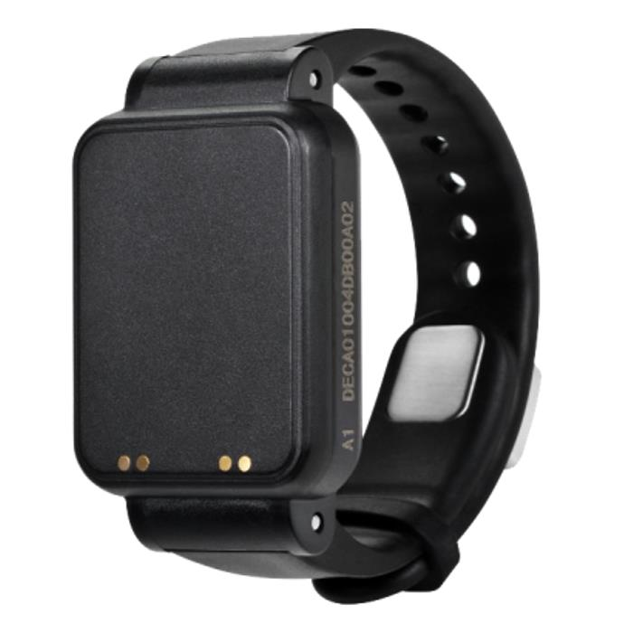

# Xexun - U02

The U02 is a professional-grade UWB anti-tamper positioning watch that is Plaspy compatible and designed to deliver centimetre-level indoor and short-range outdoor positioning where traditional GPS trackers struggle. Built for high-security and institutional deployments, the U02 combines ultra-wideband ranging, a 2.4 GHz RFID module, integrated vital-sign sensors, and active tamper protection to give operations teams precise real-time tracking and rapid incident detection within the Plaspy platform.

The U02 complements GPS tracker deployments in the Plaspy ecosystem by filling the indoor-precision gap: while GPS provides long-range outdoor telemetry and fleet management data, the U02 provides sub-meter to centimetre-level positioning, tamper alerts, and personnel telemetry \(heart rate, motion\) for environments such as correctional facilities, hospitals, schools, and industrial sites.

## Key Highlights

- Plaspy compatible integration for real-time tracking and centralized monitoring alongside GPS tracker data.
- Centimetre-level UWB positioning \(up to 10 cm accuracy under ideal conditions\) for precise indoor locating.
- Built-in 2.4 GHz RFID for two-way messaging with anchors and the management system, improving anchor-assisted workflows.
- Conductive strap loop for immediate anti-tamper alarms if the strap is cut or removed—ideal for security-sensitive deployments.
- Integrated motion and heart-rate sensors for live personnel telemetry and health event detection.
- Durable design with IP68 waterproofing, wide operating temperature range, and long standby battery life for continuous operations.
- Touch-button emergency alarm, vibration alerts, and support for system push messages to the device.

## How It Works with Plaspy

The U02 communicates precise location and sensor telemetry to Plaspy via a UWB anchor network and backend integration. Anchors receive the watch’s periodic UWB positioning packets and RFID exchanges; the anchor system or positioning engine computes location fixes and forwards location and sensor events into Plaspy for visualization, alerts, and reporting. Plaspy consolidates these indoor, short-range location events with outdoor GPS tracker telemetry to provide a unified operational view.

- Real-time location and telemetry updates: UWB-derived positions and sensor data are delivered to Plaspy for live maps and historical playback.
- Tamper & emergency events: conductive strap tamper alarms and touch-button emergency signals are sent as immediate alerts in Plaspy.
- Sensor uploads: heart rate and motion data are uploaded to the server to enable health monitoring and activity logs.
- Two-way messaging: the integrated 2.4 GHz RFID supports two-way messages between watch and anchors; Plaspy can push system messages to the device.
- Complementary to vehicle telemetry: when used with GPS trackers in Plaspy, U02 supplies precise indoor positioning where GPS is limited—useful alongside fleet management, ignition/immobilizer and fuel monitoring telemetry managed by vehicle devices.

## Technical Overview

| Positioning Technology | Ultra-Wideband \(UWB\) ranging with anchor-assisted positioning |
| --- | --- |
| UWB Frequency | 3.75–4.25 GHz |
| RFID | Built-in 2.4 GHz RFID module \(two-way messaging\) |
| Optional Interfaces | Optional NFC indicated; contact charging/data interface |
| Antenna | Internal omnidirectional antenna |
| Sensors | Integrated motion sensor and heart-rate sensor; vibration alerts; touch-button emergency alarm |
| Tamper Detection | Conductive loop embedded in strap triggers immediate tamper alarm if strap is cut or removed |
| Positioning Performance | Accuracy up to 10 cm under ideal conditions; unobstructed range up to ~80 meters \(anchor-dependent\) |
| Battery | Built-in 550 mAh rechargeable battery; standby up to 90 days; typical full charge ~2 hours; low-battery alarm at &lt;20% |
| Durability & Environment | IP68 waterproof; operating temperature −30°C to +60°C; 10–90% RH non-condensing |
| Remote Management | Supports remote firmware upgrade \(FOTA\) |
| Form Factor | Wearable wristwatch form for personnel monitoring and inspection workflows |

## Use Cases

- Prison inmate monitoring and anti-tamper security: immediate alerts on strap removal and precise indoor location for incident response.
- Staff safety and tracking in factories or hospitals: combine real-time location with heart-rate and motion telemetry for well-being monitoring.
- Attendance, inspection and patrol workflows: verify on-site personnel routes and checkpoints with centimetre-level accuracy.
- Schools and institutional deployments: managed wearable tracking for student safety and rapid location during incidents.
- Short-range asset or personnel locating where GPS tracker coverage is limited or unavailable.

## Why Choose This Tracker with Plaspy

The U02 brings a specialized layer of precision and security to Plaspy-managed deployments. Where GPS trackers supply wide-area telemetry, fleet management details, and vehicle-focused signals such as ignition or fuel monitoring, the U02 provides high-resolution indoor positioning, active anti-tamper protection, and personnel telemetry that GPS alone cannot deliver. Integrating U02 devices into Plaspy enables unified situational awareness: precise indoor locations, real-time health and movement data, and immediate tamper or emergency alerts are all available alongside conventional telemetry for a complete operational picture.

For organizations that require reliable, auditable location and event data in sensitive environments, the U02 offers rugged hardware, long battery life, and two-way messaging to anchors. Paired with Plaspy, it supports scalable deployments where security, rapid response, and fine-grained tracking are essential. If your implementation also needs vehicle telemetry such as fuel monitoring, ignition or immobilizer control, the U02 integrates in the same Plaspy platform with GPS tracker devices to provide a full telemetry solution.

