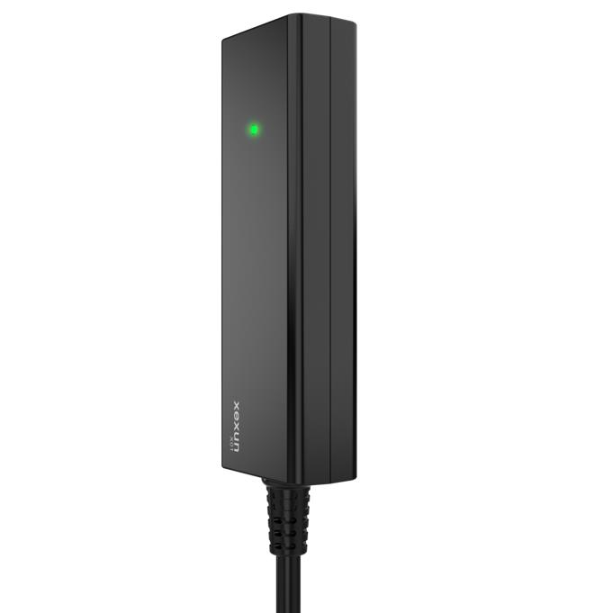

# Xexun - X01

The Xexun X01 is an industrial grade wired vehicle tracker designed for dependable, always on location monitoring. Built for compact installation across a wide range of vehicles, the X01 combines GPS and BeiDou hybrid positioning to improve fix speed and location accuracy. The device is intended for continuous real time reporting over domestic 2G/3G/4G cellular networks and includes an internal rechargeable backup battery to preserve reporting through short power interruptions.

As a Plaspy compatible device out of the box, the X01 feeds live location, historical routes, and status events directly into Plaspy’s platform. That compatibility allows fleet managers and vehicle owners to view maps, receive geofence and tamper alerts, monitor ignition status, and use Plaspy reporting and dashboards to turn raw location data into operational insight for tracking and anti theft protection.

## Key Highlights

- Plaspy compatible GPS tracker for dependable real time tracking and fleet visibility
- Hybrid GPS plus BeiDou positioning to improve fix performance and accuracy in many environments
- Wide DC 9–90 V operating range and compact form factor for flexible vehicle deployment
- Built in rechargeable 100 mAh backup battery to preserve reporting during brief power loss
- Continuous tracking with configurable reporting intervals plus geofence and tamper alerts
- Offline data buffering with automatic retransmission when connectivity is restored

## How It Works with Plaspy

When installed, the X01 transmits GNSS position and status messages over the cellular network to Plaspy where those messages become live map positions, historical route playback, alerts, and telemetry reports for users. Plaspy ingests the device data and applies rules, notifications, and dashboards so teams can monitor vehicle status and respond to events from a single platform.

- Real time location and telemetry updates displayed on Plaspy maps and dashboards
- Historical route playback and event timeline for after action review and reporting
- Geofence entry and exit alerts plus overspeed notifications routed through Plaspy
- Tamper and low battery warnings delivered as immediate notifications to operators
- Stored locations collected in network blind spots are retransmitted to Plaspy when connectivity returns
- Remote device management support for streamlined maintenance and updates through the platform

## Typical Use Cases

- Fleet management for cars, motorcycles, and light commercial vehicles to improve routing and utilization
- Anti theft monitoring with live location, tamper detection, and geofence driven alerts
- Last mile and delivery tracking where continuous location visibility and historical routes matter
- Monitoring of school and public transport routes for schedule adherence and safety checks
- Asset tracking for specialty vehicles and electric vehicles that need compact wired solutions

## Why Choose This Tracker with Plaspy

The X01 is a practical choice for organizations that need a compact, always on tracking device paired with a modern fleet management platform. Its hybrid positioning, wide voltage tolerance, and internal backup battery help maintain continuity of reporting in varied vehicle environments. When combined with Plaspy, the X01’s location and status feeds are presented as actionable information through alerts, reporting, and operational dashboards that support faster response and clearer oversight.

If you want to evaluate the X01 for your fleet, Plaspy makes it straightforward to integrate and manage device data alongside other telematics and operational workflows. Learn more about Plaspy on the main website https://www.plaspy.com. Product specifications and availability can change over time, so please verify current details and technical specifications with the manufacturer at https://www.xexun.com/.
