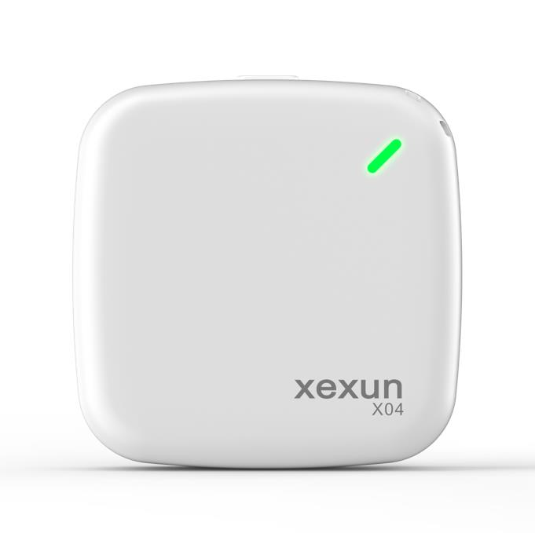

# Xexun - X04

The Xexun X04 is a compact professional grade GPS and Beidou mini tracker designed for reliable real time tracking of people, vehicles and portable assets. It uses hybrid positioning that combines satellite and local positioning aids with cellular transmission to a cloud server, delivering fast fixes and consistent coverage in areas where satellite signals can be weak. The device is sized for straightforward daily use and includes features commonly required for safety and asset oversight.

As a Plaspy compatible device, the X04 can transmit location and event data to Plaspy's cloud platform so fleet managers and individual users can monitor devices from Plaspy's web management interface and mobile client. Its support for scheduled reporting, SOS alarms, configurable geofences, blind zone buffering and remote firmware updates makes it a practical option for organizations that want a compact tracker paired with Plaspy for centralized visibility and alerting.

## Key Highlights

- Compact form factor suitable for people vehicles and portable assets while remaining professional grade.
- Hybrid positioning using satellite and local assistance for faster fixes and better coverage in marginal signal areas.
- Continuous cellular data transmission to cloud servers for live tracking and historical playback.
- Configurable geofence alerts scheduled reporting and instant SOS emergency alarm for safety and security.
- Blind zone data buffering with automatic upload once connectivity is restored to prevent data gaps.
- Remote firmware upgrade support and remote listening capability for authorized monitoring and maintenance.
- Meaningful battery life with low battery warnings to help manage device availability in the field.

## How It Works with Plaspy

When paired with Plaspy, the X04 sends periodic and event driven location and telemetry to Plaspy's cloud so users can see live positions, replay history and receive alerts centrally. Plaspy ingests the device's reports and events to provide unified fleet or asset oversight and to trigger notifications based on your configured rules.

- Real time location and telemetry updates appear on Plaspy maps for live tracking and situational awareness.
- Geofence entry and exit alerts and time period fences generate immediate notifications in Plaspy.
- SOS emergency alarms are surfaced in Plaspy with timestamp and the last reported position.
- Offline buffering on the device preserves data during connectivity gaps and uploads when service resumes.
- Scheduled reporting and route history are available in Plaspy for analysis and compliance checks.
- Device status information such as low battery and remote firmware update state is reported to Plaspy for lifecycle management.

## Typical Use Cases

- Personal safety tracking for children seniors or lone workers using SOS and remote listening features.
- Small fleet management for delivery and service teams needing live tracking and route playback.
- Asset protection and anti theft monitoring with geofence alerts and blind zone buffering.
- Portable equipment and rental asset tracking to maintain location history and usage oversight.
- Urban pet tracking where hybrid positioning improves location reliability in built up areas.

## Why Choose This Tracker with Plaspy

The X04 pairs practical tracking features and a small footprint with Plaspy's centralized monitoring and alerting capabilities. For teams and individuals who need straightforward real time visibility, geofence management and emergency alarms, the X04 delivers the core functionality that integrates cleanly with Plaspy without unnecessary complexity.

Choosing the X04 with Plaspy lets organizations benefit from consolidated device management, historical route playback and configurable notifications while maintaining a compact tracking solution for people vehicles and portable assets. To learn more about Plaspy and how the platform can manage X04 devices visit https://www.plaspy.com. Product specifications availability and manufacturer details can change over time so please verify current specifications and regional variants on the manufacturer site at https://www.xexun.com/ before purchase.
