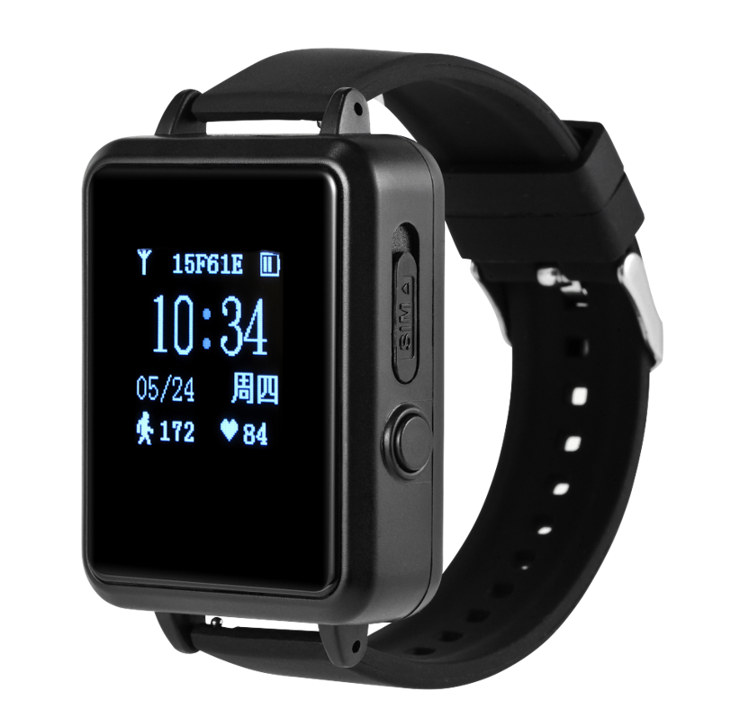

# Xexun - X07

The X07 is a wearable GPS and BeiDou health positioning watch designed for reliable personal safety and elder care monitoring. It combines multi mode positioning with onboard physiological sensors to deliver continuous location and vital sign telemetry. The device is built for everyday use and emphasizes fast positioning, simple device management, and concise health insights suitable for monitoring individuals on the move.

As a Plaspy compatible device, the X07 can forward location fixes and health telemetry into Plaspy’s monitoring environment so caregivers and operations teams can view live location, route history, and receive geofence and health alerts. Integration with Plaspy brings wearable data into the same operational dashboard used for asset and fleet monitoring, helping organizations centralize oversight of people and equipment.

## Key Highlights

- Plaspy compatible integration for centralized monitoring of location, alerts, and device status.
- Multi mode positioning using GPS, BeiDou, WiFi, and LBS fusion for improved location availability.
- Continuous health telemetry from onboard motion, heart rate, and blood pressure sensors.
- Two way voice and configurable geofence alarms to keep caregivers connected and informed.
- Scheduled tracking, remote firmware management, and cloud integration for scalable device administration.
- Compact wearable form factor with rechargeable battery suitable for everyday elder care and personal safety.

## How It Works with Plaspy

Once configured for Plaspy compatibility, the X07 forwards position and physiological telemetry to Plaspy where incoming data is normalized and presented for real time monitoring, alerting, and historical reporting. Plaspy provides a single pane view for device status and notifications so teams can act on location and health signals without managing separate systems.

- Real time location and telemetry visible on Plaspy maps and live device views.
- Vital sign and motion telemetry available as data points for monitoring and alert rules.
- Geofence and out of bound alarms trigger notifications to caregivers or operations staff.
- Two way voice availability and device battery or connection state shown in Plaspy device lists.
- Scheduled tracking and automatic timed reporting allow tuning of update frequency for different monitoring needs.

## Typical Use Cases

- Elder care and assisted living monitoring with live location and vital sign alerts.
- Lone worker personal safety where position reporting and two way voice support emergency response.
- Personal location services for families and caregivers with geofence and routine tracking.
- Remote health aware activity monitoring for clinicians or remote care programs.
- Extending fleet and asset management to include people centric safety monitoring alongside vehicles.

## Why Choose This Tracker with Plaspy

The X07 brings wearable grade telemetry into Plaspy’s operational view, enabling organizations to centralize personal safety alongside traditional GPS tracking. Its combination of multi mode positioning and onboard health sensors provides contextual information that helps caregivers and operations teams prioritize responses and maintain situational awareness.

If you want to learn more about how Plaspy can incorporate wearables like the X07 into your monitoring workflows, visit https://www.plaspy.com. Product specifications, availability, and manufacturer features can change over time, so please verify current technical details and support information on the manufacturer site https://www.xexun.com/.
