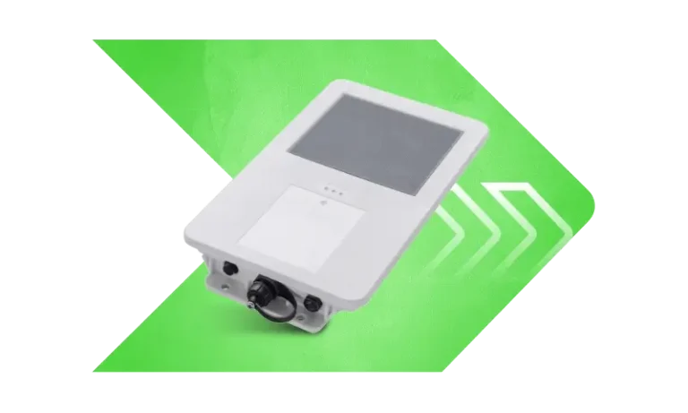

# Xirgo - XT49

The XT49 is a rugged GPS tracker designed for long term, remote deployments where service access is limited. Built with integrated solar energy harvesting and LTE connectivity, the XT49 provides continuous, low maintenance tracking suited to containers, long haul trailers, and other assets that spend extended time away from routine servicing. Its fully sealed protective case and durable construction make it appropriate for harsh marine and desert environments.

As a Plaspy compatible device, the XT49 forwards location updates and operational status so fleet managers and asset owners can monitor assets from Plaspy’s fleet management platform. When paired with Plaspy, the XT49 supports real time tracking, alerting, and historical telemetry review, making it a practical option for organizations that need long duration visibility with reduced field maintenance.

## Key Highlights

- Integrated solar energy harvesting to support long term deployments and reduce maintenance visits.
- LTE connectivity for continuous transmission of location and status data to a cloud platform.
- Fully sealed protective enclosure designed for reliable operation in harsh marine and desert conditions.
- Optimized form factor for containers, long haul trailers, and remote equipment with limited access.
- Low maintenance operation that helps reduce total cost of ownership for large scale asset programs.
- Designed to deliver continuous uptime and persistent visibility for remote assets.

## How It Works with Plaspy

When the XT49 is deployed, it transmits location and operational status over LTE to Plaspy, where that telemetry is ingested and presented for monitoring and decision making. Plaspy centralizes device data so operations teams can view live positions, receive alerts, and analyze historical movement without needing to visit assets frequently.

- Real time location updates and operational telemetry displayed in Plaspy for fleet oversight.
- Visibility of solar charge and battery status in Plaspy to support scheduled maintenance decisions.
- Geofence and movement alerts to support anti theft workflows and rapid response procedures.
- Historical tracks and event reports to support compliance, audits, and operational analysis.
- Configurable reporting cadence to balance tracking resolution and long term power management.

## Typical Use Cases

- Container tracking in remote terminals and long maritime transits where rugged sealing is required.
- Long haul trailer visibility across extended routes with minimal field access.
- Remote asset monitoring for equipment left in seasonal or isolated locations.
- Anti theft and movement detection for high value movable assets using geofence alerts.
- Large scale fleet programs that need low maintenance trackers to reduce site visits.

## Why Choose This Tracker with Plaspy

The XT49 is a practical choice for organizations seeking a durable, low maintenance tracker for remote deployments. Its solar energy harvesting and sealed design make it well suited to assets that operate in environments where regular servicing is difficult. Paired with Plaspy, the XT49 provides continuous visibility and centralized operational tools that simplify monitoring, alerting, and reporting for dispersed fleets and remote assets.

Learn more about Plaspy on the main website https://www.plaspy.com and verify current XT49 specifications and availability on the manufacturer's site https://xirgo.com/ as product details and regional options can change over time.
