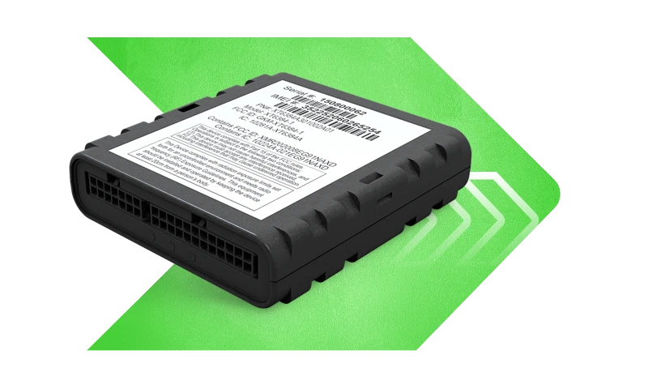

# Xirgo - XT63

# XT63

The XT63 is a Plaspy compatible vehicle telematics GPS tracker designed for fleet managers who need reliable, real-time tracking and flexible telemetry integration. Built for passenger cars, light- to heavy-duty trucks, and commercial equipment, the XT63 combines embedded cellular and GPS with optional Bluetooth to reduce installation complexity and accelerate deployment on Plaspy-powered monitoring and fleet management platforms.

With support for OBD and JBUS protocols and a configurable communication stack, the XT63 delivers instant geofence notifications, rich vehicle data, and customizable data packets to match evolving business needs. The device is engineered for rapid customization, secure data transport, and practical I/O for ignition, door/alarm events, and actuator control—making it an ideal GPS tracker for Plaspy-compatible solutions focused on anti-theft, telemetry, and operational efficiency.

## Key Highlights

- Plaspy compatible GPS tracker offering real-time tracking and fleet management integration out of the box.
- Multi-network connectivity: LTE Cat 1 with 3G/2G fallbacks \(model-dependent\) for broad coverage and roaming.
- Optional OBD and JBUS support to capture engine parameters, fuel monitoring, and ignition data where available.
- Instant geofence notifications and 3-axis accelerometer for motion-based alerts and anti-theft monitoring.
- Embedded cellular and GPS antennas with optional Bluetooth antennas to simplify installation and enable Bluetooth sensors.
- Robust I/O: 5 digital inputs, 1 analog input, 3 outputs, 2 1-wire bus ports, and 2 RS232 ports for vehicle integrations.
- Secure transport options including AWS MQTT with TLS 1.2, MQTT, HTTPS, UDP, and SMS for flexible telemetry delivery to Plaspy.

## How It Works with Plaspy

Integrating the XT63 with Plaspy enables continuous, reliable data flow from vehicle to dashboard. The device transmits location and telemetry using industry-standard protocols supported by Plaspy, allowing fleet managers to receive live tracking, automated alerts, and structured reports without complex middleware.

- Real-time location and telemetry updates sent via MQTT/HTTPS/UDP/SMS to Plaspy endpoints.
- Ignition, door, and alarm status using the device’s digital inputs for event-driven alerts and status reporting.
- Fuel monitoring and engine telemetry when the unit is connected to OBD or JBUS interfaces, enabling consumption and diagnostics data in Plaspy.
- Remote actuator control \(for example starter cut/immobilizer integration\) using device outputs where vehicle wiring and policies permit.
- Bluetooth sensors and beacons supported via optional Bluetooth antenna to add temperature, cargo presence, or proximity telemetry to Plaspy dashboards.

## Technical Overview

| Connectivity | LTE Cat 1; 3G UMTS/HSPA; 2G GSM \(availability varies by device model\) |
| --- | --- |
| Bands | Network generation support listed above \(regional band variants depend on model\) |
| Power & Battery | Vehicle-powered with optional 250 mAh rechargeable backup battery \(optional\) |
| Interfaces | 5 digital inputs, 1 analog input, 3 outputs, 2 1-wire bus ports, 2 RS232 ports; optional OBD and JBUS protocol support |
| GNSS | Embedded GPS with integrated antenna |
| Bluetooth | Optional Bluetooth antenna to support Bluetooth sensors and beacons |
| Remote Management & Protocols | SMS, UDP, MQTT, AWS MQTT with TLS 1.2, HTTPS; customizable data packets and platform-level customization |
| Certifications | FCC, AT&T, Verizon, CE\(RED\) |
| Form Factor | Compact vehicle telematics module suitable for passenger, commercial, and heavy-duty installations |

## Use Cases

- Fleet management: real-time tracking, route adherence, and driver behavior telemetry integrated into Plaspy for operations optimization.
- Anti-theft and recovery: motion detection, geofence violations, and event-driven alerts enable rapid response to unauthorized vehicle movement.
- Fuel monitoring and diagnostics: when connected via OBD or JBUS, capture fuel level, consumption trends, and engine fault codes for cost control.
- Remote control and security: use digital outputs to interface with immobilizers or starter-cut systems where permitted to prevent unauthorized use.
- Cold chain and asset monitoring: add Bluetooth sensors for temperature or door-open detection on refrigerated or sensitive cargo, feeding data directly into Plaspy.

## Why Choose This Tracker with Plaspy

The XT63 delivers a balanced combination of connectivity, vehicle interface options, and secure telemetry protocols that make it an effective GPS tracker for Plaspy-compatible deployments. Its optional OBD/JBUS integration and extensive I/O let you capture the specific ignition, fuel, and event data that fleet management and anti-theft applications require. With multiple transport protocols including AWS MQTT with TLS 1.2 and customizable data packets, the XT63 integrates smoothly into Plaspy for scalable real-time tracking, robust telemetry, and responsive alerting.

For fleets and equipment owners seeking a trustworthy, flexible GPS tracker, the XT63 provides proven certification \(FCC, AT&T, Verizon, CE\(RED\)\), embedded antennas to simplify installs, and a platform engineered for rapid customization—helping you deploy Plaspy-compatible tracking solutions faster and with the telemetry fidelity needed to improve efficiency and security.

