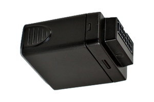

# Xirgo - XT-2100

The Xirgo XT-2100 is a versatile GPS tracker designed for mobile and remote asset monitoring and control. It features a cellular GPRS modem with an integrated GPS engine, making it an ideal solution for applications such as mobile resource management, aftermarket automotive, consumer solutions, and driver behavior monitoring and modification.

With its compact design and integrated antennas, the XT-2100 is a fully integrated tracking device that can be discreetly installed in tight locations. It provides vehicle owners with real-time information about the location, speed, and direction of their vehicles, allowing for efficient fleet management and asset tracking. The tracker also offers two all-purpose digital inputs and one internal analog input for monitoring battery voltage, as well as a digital output that can drive ignition relays.

One of the standout features of the XT-2100 is its extensive connectivity options. It supports TCP, UDP, and FTP protocols, allowing for seamless communication with remote servers. The tracker is also capable of firmware updates and configuration over-the-air, ensuring that it can adapt to changing requirements and technologies. Additionally, the XT-2100 is a quad-band GSM/GPRS modem, making it compatible with GSM networks in virtually any country.

Overall, the Xirgo XT-2100 is a reliable and cost-effective GPS tracker that offers a range of features for mobile and remote asset monitoring and control. Whether you need to track vehicles for fleet management purposes or monitor driver behavior, the XT-2100 provides the functionality and flexibility to meet your needs.

