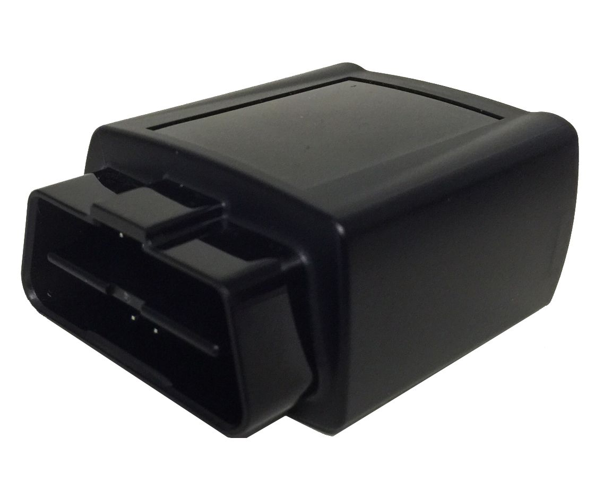

# Xirgo - XT-2400

The Xirgo XT-2400 is a plug and play OBD II device designed for passenger and light duty vehicles. It provides vehicle location tracking combined with access to vehicle parameters such as VIN and ignition status, and it can surface diagnostic fault codes for maintenance workflows. Integrated antennas and a high precision GPS engine are part of the device package, and an accelerometer enables movement and acceleration detection.

As a Plaspy compatible tracker, the XT-2400 can be used to feed vehicle location, status, and diagnostic information into Plaspy for fleet visibility and operational oversight. Its scriptable capability makes it possible to tailor the device behavior for specific monitoring and alerting use cases inside Plaspy, allowing organizations to adapt reporting and event triggers to their workflows.

## Key Highlights

- Plug and play OBD II form factor suited for passenger and light duty vehicles
- Scriptable device logic for customization to match solution requirements
- Embedded cellular and GPS antennas for integrated communication and location
- High precision GPS engine for accurate positioning
- Built in accelerometer to detect movement and acceleration events
- Ability to report vehicle parameters including VIN ignition status speed and diagnostic fault codes

## How It Works with Plaspy

When connected to Plaspy the XT-2400 can provide vehicle position and status data that Plaspy uses for monitoring dashboards reporting and alerts. Plaspy ingests the tracker data to help teams track assets and respond to events while retaining configurable display and reporting options.

- Provide continuous location updates to Plaspy for mapping and route visibility
- Report vehicle status such as ignition state and speed for operational monitoring
- Send diagnostic fault codes to Plaspy to support maintenance notifications and workflows
- Use accelerometer events to flag harsh driving or movement events within Plaspy alerts
- Leverage the device scriptability to tailor which events and telemetry are sent to Plaspy

## Typical Use Cases

- Fleet tracking for passenger vehicle and light duty vehicle operations
- Aftermarket automotive solutions that require vehicle diagnostics and location
- Mobile resource management where plug and play installation is preferred
- Driver behavior monitoring and coaching using accelerometer and status data
- Consumer solutions that combine vehicle status and location reporting

## Why Choose This Tracker with Plaspy

The XT-2400 is a practical option for organizations that want an OBD II based tracker with built in location and diagnostic capabilities. Its plug and play nature reduces installation complexity for passenger and light duty vehicles, while scriptable logic provides flexibility to adapt device behavior to specific Plaspy workflows and reporting needs.

Choosing the XT-2400 for use with Plaspy can help teams combine vehicle telemetry and diagnostics with Plaspy dashboards and alerts to improve visibility and support maintenance planning. The device is well suited to scenarios where quick deployment, vehicle parameter access, and customizable event reporting are valuable.

To learn more about using Plaspy with compatible devices visit https://www.plaspy.com. Product specifications and availability can change over time so please verify current device details and technical documentation on the manufacturer site https://xirgo.com/.
