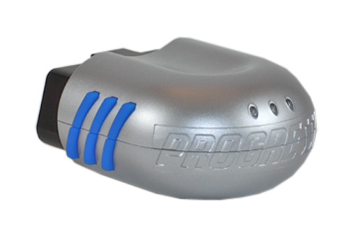

# Xirgo - XT-3200

The Xirgo XT-3200 is a versatile plug and play OBD II device designed for passenger and light-duty vehicles. This GPS tracker is specifically designed to monitor and communicate vital vehicle information, making it an ideal choice for various applications.

One of the key applications of the XT-3200 is driver behavior monitoring and modification. With its embedded cellular antenna and accelerometer, this tracker can accurately track and analyze driving behavior, providing valuable insights for fleet managers and insurance companies. It can monitor parameters such as ignition status, harsh braking, rapid acceleration, and excessive idling, allowing for the identification of unsafe driving habits and the implementation of driver training programs.

In addition to driver behavior monitoring, the XT-3200 is also suitable for aftermarket automotive solutions. It can be easily installed in vehicles without the need for any additional wiring or modifications. This makes it a cost-effective solution for businesses looking to add GPS tracking capabilities to their existing fleet.

Furthermore, the XT-3200 is also a great choice for consumer solutions. It allows individuals to track their own vehicles, ensuring peace of mind and providing valuable information in case of theft or unauthorized use.

Some of the outstanding features of the Xirgo XT-3200 include an embedded cellular antenna for reliable communication, an accelerometer for accurate tracking of driving behavior, and an integrated OBDII interface that enables monitoring of ignition status and other vehicle parameters. With its plug and play design, this GPS tracker is easy to install and use, making it a convenient choice for both businesses and individuals.

