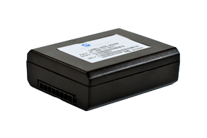

# Xirgo - XT-4500

The Xirgo XT-4500 is an ultra low power GPRS modem with an integrated GPS receiver and onboard power management, designed for tracking and control of high value assets that lack consistent power access. Compact and purpose built, the XT-4500 combines a rechargeable battery controller and a 32 bit microprocessor with a power management algorithm to extend deployment life. Integrated cellular and GPS antennas and optional weatherproof housing make it suitable for a range of remote asset tracking scenarios.

As a Plaspy compatible device, the XT-4500 can feed location, status, and health information into Plaspy for centralized monitoring and operational oversight. Its low power design and optional motion detection and accelerometer features make it a practical choice when paired with Plaspy for fleets or dispersed equipment where intermittent power and environmental exposure are common concerns.

## Key Highlights

- Ultra low power design suited for assets with inconsistent or limited power availability
- Integrated cellular and GPS antennas for compact, self contained deployments
- Rechargeable battery controller with selectable internal battery capacity options
- Optional motion detector and accelerometer to detect movement and activity
- Robust performance in challenging conditions enabled by advanced GPS technology
- Optional weatherproof case and compact size for outdoor or constrained installations

## How It Works with Plaspy

The XT-4500 transmits location and device status information that Plaspy can ingest to provide visibility and reporting across your assets. Once connected, Plaspy presents position data, activity indicators, and device health metrics so teams can monitor remote equipment and respond to events.

- Real time and historical location display in Plaspy for route review and playback
- Alerts for movement, inactivity, or low battery status delivered through Plaspy notification rules
- Asset status and health reporting to help prioritize maintenance and reduce downtime
- Fleet level dashboards and summaries for operational oversight and trend analysis
- Integration into Plaspy reporting to create exportable summaries for audits and operations

## Typical Use Cases

- Tracking of container trailers and shipping assets during transit and storage
- Motorcycle and small vehicle tracking where compact hardware is required
- Monitoring high value or long idle assets with intermittent power availability
- Remote equipment and machinery oversight for maintenance planning
- Mobile resource management for dispersed field assets

## Why Choose This Tracker with Plaspy

The XT-4500 is a practical option when you need a compact, low power tracker that can operate in environments with limited or unreliable power. Its battery management features and optional motion sensing make it well suited to applications where long standby times and reliable wake on movement are important. When paired with Plaspy, organizations gain a centralized view of location, activity, and device status that supports informed operational decisions.

If you want to evaluate the XT-4500 for your deployment, Plaspy can help convert the device data into actionable insights for fleet managers and asset owners. Learn more about Plaspy and how compatible trackers are supported on the Plaspy website https://www.plaspy.com. Product specifications, availability, and manufacturer details can change over time so please verify current specifications and options with the manufacturer documentation at https://xirgo.com/ before finalizing a purchase.
