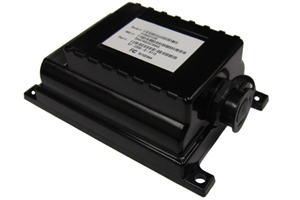

# Xirgo - XT-4700

The Xirgo XT-4700 is a rugged and self-contained cellular wireless modem designed for outdoor use. It is equipped with an integrated GPS engine, making it ideal for tracking high-value assets, containers, and trailers. With its powerful 32-bit microprocessor and unique power management algorithm, the XT-4700 consumes less than 120 µA in sleep mode while still being capable of periodic reporting of health, status, and location of remote assets. This makes it an efficient and reliable solution for monitoring and controlling high-value remote assets, especially in situations where power availability is a concern.

The XT-4700G is equipped with the latest GPS technology, allowing for accurate tracking even under extreme conditions where other competing products may fail. Its weatherproof case meets the IEC 68-2-27 environmental standard and is IP66 certified, ensuring its durability and suitability for a wide range of applications, including container, trailer, and motorcycle tracking. Additionally, the XT-4700G features embedded cellular and GPS antennas, an integrated high-precision GPS engine, a 6600 mAh rechargeable battery, and options for an accelerometer and motion detector. Its rugged enclosure and integrated mounting flange with multiple options further enhance its versatility and ease of use.

### Key Features:

- Embedded cellular and GPS antennas
- Integrated high-precision GPS engine
- 6600 mAh rechargeable battery
- Accelerometer and motion detector
- Rugged, IP66 rated enclosure for outdoor use
- Integrated mounting flange with multiple options

