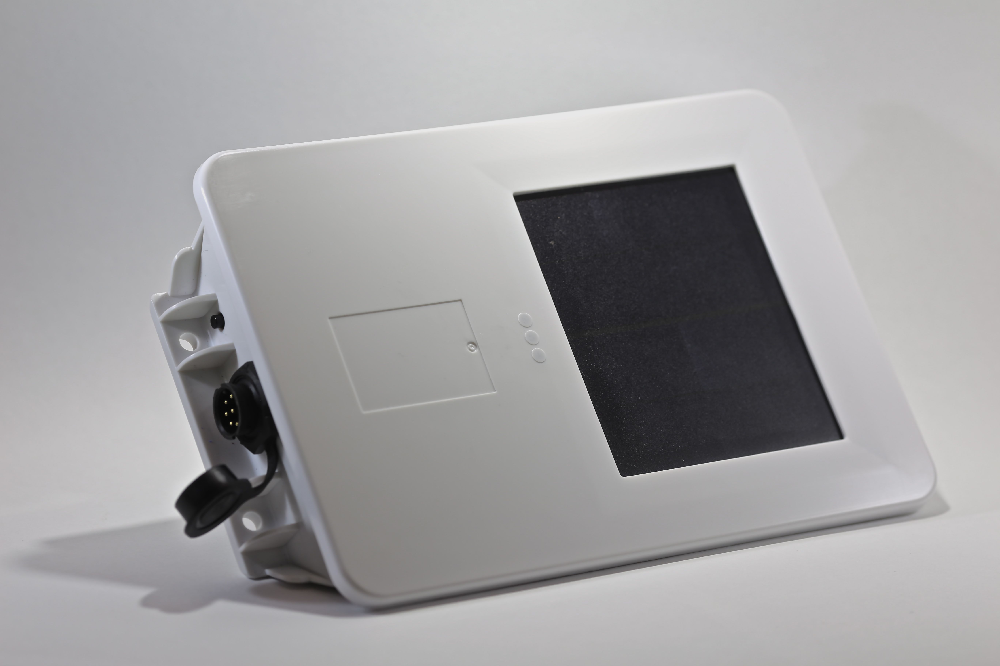

# Xirgo - XT-4800

The Xirgo XT-4800 is an energy harvesting GPS tracker designed for long term remote deployments. Its self charging design and energy harvesting capability reduce the need for frequent servicing, making it suitable for monitoring remote or non powered assets. The device is built to provide frequent location and status updates over extended periods and includes an IP67 sealed enclosure for protection in harsh environments.

As a Plaspy compatible device, the XT-4800 can feed frequent location and health data into Plaspy for fleet and asset visibility. Plaspy can ingest the tracker data to provide mapping, historical routes, alerting, and operational oversight, making the XT-4800 a practical option for organizations that need long lasting, low maintenance tracking combined with a modern fleet management platform.

## Key Highlights

- Energy harvesting design for extended remote deployments and reduced maintenance intervals.
- IP67 rated housing for sealed protection in marine dusty and wet conditions.
- Embedded GPS and cellular antennas with a high precision GPS engine for reliable location reporting.
- Designed to deliver more frequent data for longer periods compared to many asset trackers.
- Flexible connectivity and data transfer options including support for common data protocols and remote communication.
- Extensive inputs and outputs plus optional 1 Wire Bus and Zigbee compatibility to support additional device capabilities.

## How It Works with Plaspy

The XT-4800 transmits periodic location and status data that Plaspy can collect and present through its fleet management interface. Plaspy organizes the incoming data to give operators actionable visibility into asset location, uptime, and movement patterns.

- Real time and historical location visibility on Plaspy maps and dashboards.
- Fleet and asset grouping for organized monitoring of equipment and mobile resources.
- Alerts and notifications based on location changes, inactivity, or other status criteria configured in Plaspy.
- Reporting and analytics for utilization, movement history, and deployment performance.
- Reduced maintenance workflows enabled by the device long life and Plaspy scheduling or alerting features.

## Typical Use Cases

- Tracking dry containers and cargo that require long term unattended monitoring.
- Monitoring non powered assets such as trailers and equipment left in remote locations.
- Deployment on heavy equipment that operates in dusty or wet environments.
- Remote marine or desert asset tracking where environmental sealing and longevity are priorities.
- Situations where frequent location updates and low maintenance are critical for operational visibility.

## Why Choose This Tracker with Plaspy

The XT-4800 is a fit for organizations that need persistent visibility of remote assets without frequent battery replacements or servicing. Its energy harvesting capability and rugged IP67 construction make it well suited to harsh environments, while its design emphasis on frequent data helps Plaspy deliver timely insights for operations teams.

Paired with Plaspy, the XT-4800 provides a low maintenance data source that integrates into a broader fleet management workflow for mapping, alerts, and reporting. For teams managing widely dispersed or hard to reach assets, this combination supports sustained monitoring and operational control with fewer site visits.

To learn more about how Plaspy can work with compatible devices such as the Xirgo XT-4800 visit https://www.plaspy.com. Product specifications and availability can change over time, so please verify current technical details and compatibility on the manufacturer site https://xirgo.com/.
