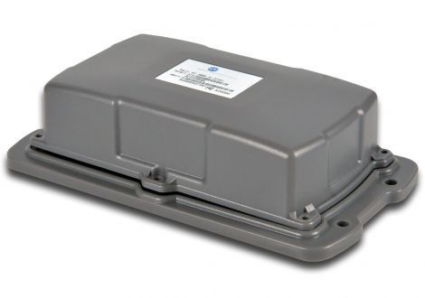

# Xirgo - XT-5000

The Xirgo XT-5000 is a compact, rugged GPS tracker designed for long term deployments where reliability and low maintenance are critical. It combines an integrated GPS engine, a 32 bit microprocessor, and an efficient power management approach to provide continuous location and status reporting while minimizing power draw. The device is built for harsh outdoor environments and includes integrated antennas, motion detection, and an optional accelerometer to support extended remote operation.

As a Plaspy compatible device, the XT-5000 fits naturally into remote asset and fleet monitoring workflows that require persistent visibility with minimal maintenance. Its ultra low power consumption, long battery life options, and rugged construction make it a practical choice for organizations using Plaspy to track trailers, containers, and other assets that may be deployed for months or years between service intervals.

## Key Highlights

- Ultra low power consumption designed for long term deployments, supporting periodic reporting while conserving energy
- Optional high capacity internal battery enables multi year operation in properly configured setups
- Rugged construction meeting relevant environmental standards for outdoor use and harsh conditions
- Integrated GPS engine and built in cellular antennas for simplified hardware footprint
- Motion detector and optional accelerometer to support movement based reporting and wake events
- Dedicated microprocessor with power management algorithms for efficient background operation

## How It Works with Plaspy

When integrated with Plaspy, the XT-5000 streams periodic location and status updates into the Plaspy platform so teams can monitor remote assets from a central dashboard. Plaspy can surface the device health and reporting cadence alongside location history to support operational decisions and maintenance planning.

- Ingest periodic location and health reports from the tracker into Plaspy for continuous visibility
- Configure movement alerts and notifications in Plaspy based on motion detector events reported by the device
- Build geofence alerts and route compliance checks using the tracker location data inside Plaspy
- Use Plaspy reporting tools to analyze long term uptime, location history, and asset deployment patterns
- Create automated alerts for extended inactivity or changes in reporting that may indicate maintenance needs

## Typical Use Cases

- Trailer and container tracking for logistics and supply chain visibility
- Long term remote asset monitoring where regular access for maintenance is limited
- Fleet oversight for equipment that spends long periods parked or in storage between moves
- Site or outdoor equipment tracking in harsh environmental conditions
- Asset tracking programs that prioritize long battery life and low maintenance

## Why Choose This Tracker with Plaspy

The XT-5000 is a practical match for Plaspy users who need a durable, low maintenance tracking solution for assets in challenging conditions. Its design emphasis on power efficiency and ruggedness helps reduce site visits and battery swaps, while integrated antennas and movement sensing simplify hardware requirements for deployments monitored through Plaspy.

If you want to explore how the XT-5000 can be used with Plaspy for your fleet or asset program, learn more about Plaspy on the main website https://www.plaspy.com. Product specifications, availability, and manufacturer details can change over time, so please verify current XT-5000 technical information and environmental ratings at the official Xirgo site https://xirgo.com/.
