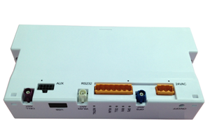

# Xirgo - XT-6200

The Xirgo XT-6200 is a global, self contained remote asset tracking device designed for reliable location and status monitoring of mobile and stationary assets. It is positioned for use in mobile resource management, high value asset protection, and remote deployments where continuous visibility is important. The XT-6200 combines embedded GPS and cellular antennas with a high precision GPS engine and options for local connectivity to support a wide range of asset types such as trailers, containers, generators, and other valuable equipment.

As a device compatible with Plaspy, the XT-6200 can feed location and status data into Plaspy's fleet and asset management environment to provide consolidated visibility and reporting. Its serial interface options, ZigBee mesh capability, onboard storage and optional motion sensing make the device a flexible source of telemetry that Plaspy can present in maps, reports, and alerts. This combination makes the XT-6200 a practical choice when you need dependable tracking integrated into a centralized platform.

## Key Highlights

- Global remote asset tracking designed for mobile and stationary resources
- Embedded cellular and GPS antennas with a high precision GPS engine for consistent location data
- ZigBee mesh network support to extend local communications and integrate nearby sensors
- Serial interface plus RS 232 and USB connectivity for integration with external equipment
- Onboard flash memory with upgrade option to store historical tracking data
- Optional accelerometer and motion detection for movement and activity insights
- Large capacity battery for extended unattended operation

## How It Works with Plaspy

The XT-6200 transmits location and status information that Plaspy ingests to provide live monitoring, historical playback, and operational reporting. Plaspy uses incoming data from the device to give teams clearer situational awareness and to generate alerts and summaries that support decision making.

- Real time location monitoring and map display of assets managed in Plaspy
- Historical tracking and playback using onboard stored data to analyze past movements
- Event and movement alerts surfaced in Plaspy based on motion detector signals or status changes
- Integration of external device data via the XT-6200 serial or USB connections so Plaspy can show extended telemetry
- Use of ZigBee linked sensors and devices to bring local networked data into Plaspy views
- Customizable reporting and exportable data to support operational workflows and audits

## Typical Use Cases

- Tracking trailers and shipping containers in long distance logistics
- Monitoring generators and remote power assets at off grid sites
- Managing high value equipment in rental fleets or construction yards
- Mobile resource management for dispersed vehicle or equipment fleets
- Long term asset monitoring where onboard storage and battery life are important

## Why Choose This Tracker with Plaspy

The XT-6200 is a versatile, self contained option for organizations that need a dependable remote tracker that can integrate with a central platform. Its combination of high precision GPS, embedded antennas, local communications through ZigBee, and physical connectivity options makes it suitable for mixed asset portfolios where different types of telemetry may be required. When paired with Plaspy, the device can contribute to a unified view of assets, combining live location, historical context, and event driven alerts into one operational interface.

Because the XT-6200 offers customizable features and onboard storage, it can support workflows that require both continuous monitoring and occasional offline data capture. Plaspy can present that information in maps, reports, and alerts to help teams reduce downtime, improve asset utilization, and maintain visibility across remote deployments. To learn more about Plaspy and how it works with compatible devices like the Xirgo XT-6200 visit https://www.plaspy.com. Product specifications and availability can change over time, so please verify current technical details and options on the manufacturer site https://xirgo.com/.
