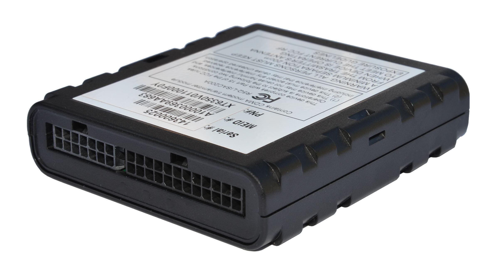

# Xirgo - XT-6300

The Xirgo XT-6300 is a versatile GPS tracker designed for a wide range of vehicle and equipment telematics applications. It combines a high precision GPS engine with embedded antennas and onboard motion sensing to deliver reliable location data and basic movement detection. The device also includes script enabled firmware and optional interfaces for vehicle diagnostics and wireless connectivity, supporting a variety of monitoring and control scenarios.

As a Plaspy compatible device, the XT-6300 can feed location, motion, and diagnostic related information into Plaspy for centralized fleet and asset management. Its flexible feature set makes it suitable for organizations that need location visibility, equipment diagnostics, or tailored telematics behavior. Plaspy can ingest and present the XT-6300 data alongside other devices to provide unified operational oversight.

## Key Highlights

- High precision GPS engine with embedded antennas for consistent location tracking
- Script enabled firmware for customization and flexible behavior
- Integrated motion sensing with a 3 axis accelerometer for movement and motion events
- Optional vehicle bus interfaces for diagnostics and maintenance related data
- Optional Bluetooth functionality to extend local connectivity options
- Support for device management platforms to simplify remote oversight

## How It Works with Plaspy

When integrated with Plaspy, the XT-6300 provides live location and event data that can be visualized, analyzed, and used to trigger operational workflows. Plaspy aggregates the device output and presents it in dashboards and reports to help teams monitor assets in real time and review historical activity.

- Live location visibility and map tracking for vehicles and mobile equipment
- Motion and activity detection can be used to generate alerts for starts stops and unusual movement
- Diagnostic and vehicle bus data can be surfaced in Plaspy for maintenance planning and exception reporting
- Historical routes and event logs available for compliance review and operational analysis
- Alerts and notifications based on configurable rules to support operational oversight

## Typical Use Cases

- Fleet vehicle tracking for routing visibility and asset location
- Equipment monitoring for remote sites and mixed asset fleets
- Telematics driven maintenance planning using diagnostic data
- Regulatory and operational reporting including hours of operation and event histories
- Remote monitoring of motion and unauthorized movement for security purposes

## Why Choose This Tracker with Plaspy

The XT-6300 is a practical choice for organizations that require a blend of precise location tracking, motion sensing, and the ability to access vehicle diagnostic information. Its script enabled firmware and optional interfaces offer adaptability, allowing integrators and fleet managers to tailor behavior to specific operational needs without changing hardware.

Paired with Plaspy, the XT-6300 becomes part of a centralized monitoring environment where location, motion events, and diagnostics can be combined with other fleet data. This combination helps teams maintain visibility across mixed device fleets and supports analysis, reporting, and alerting workflows in a single platform.

To learn more about Plaspy and how compatible devices are used for fleet tracking and telematics visit https://www.plaspy.com. Product specifications and availability can change over time, so please verify current technical details and options on the manufacturer website https://xirgo.com/.
