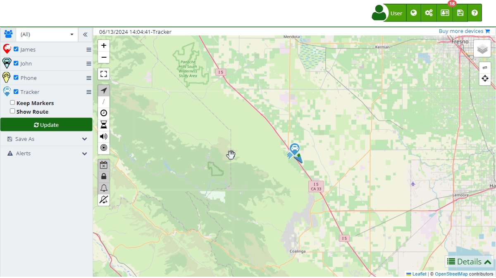

# Activity Summary
The [Activity Summary](https://app.plaspy.com/Summary) in Plaspy is an essential tool for monitoring the behavior of tracked devices over a specific period. This feature allows users to review routes, fuel consumption, and other important aspects of the vehicles or assets they are managing.

To access the Activity Summary, follow these steps:

1. Go to the top right corner in \(\) and then select " Stadistics".
2. Select "[Activity Summary](https://app.plaspy.com/Summary)."

### Activity Summary Fields

- **Date:** Select the date or date range you want to analyze. This will allow you to see all activities performed by the devices during the selected period.
- **Group:** Allows you to choose a specific group of devices to filter the results. If none is selected, data from all devices will be displayed.
- **Device:** Select the specific device from which you want to view the activity summary. You can choose multiple devices if necessary.

### Step-by-Step Instructions

1. **Select Date:** Click on the calendar icon \(\) to choose the date or date range you want to analyze.
2. **Choose Group:** Use the dropdown menu to select the group of devices you want to monitor.
3. **Select Device:** Use the multi-select option to choose one or more specific devices.
4. **Update Data:** Once you have made your selections, click the " Update" button to load the corresponding information on the map and charts.
5. **Save to Excel:** If you want to save the activity summary, click "" to export the data to an Excel file for further analysis.
6. **Email Notifications:** You can set up notifications to receive activity summaries by email. This is done by clicking the " Email Notifications" button and filling in the necessary details in the pop-up window.

### Interaction through Integrated AI Chat

At Plaspy, we have integrated an innovative feature that allows users to interact with the Activity Summary through an online chat powered by artificial intelligence \(AI\). This tool provides an intuitive and efficient way to obtain information and make inquiries about the data of your tracked devices. Below are the capabilities and advantages of this functionality:

#### Features of the Integrated AI Chat

1. **Real-Time Queries:**

    - You can ask direct questions about the current status of your devices, such as "What is the fuel level of vehicle A?" or "Where is device B located right now?"
    - The AI will respond immediately with the latest information available in the system.
2. **Request New Information:**

    - If you need to generate a specific report or analyze a new data set, simply ask the AI to do it for you. For example, "Generate an activity summary for the last week" or "Show the speed graph for device C."
    - The AI will process your request and provide the desired result.
3. **Detailed Data Exploration:**

    - The AI can break down the information contained in the activity summaries and present specific data according to your needs. You can ask, "How many speed alerts were there yesterday?" or "What was the maximum speed recorded today?"
    - This facilitates a deep and detailed understanding of the data without needing to manually navigate through multiple sections.

#### Benefits of Using the AI Chat

- **Efficiency and Time Savings:**Direct interaction with the data through the chat reduces the time it would normally take to search for and analyze information.
- **Accessibility and Ease of Use:**No advanced technical knowledge is required to use this tool. The AI is designed to understand and respond in natural language, making it easy for all users to use.
- **Constant Updates:**Being integrated with the Plaspy system, the AI provides real-time updated data, ensuring you always have the most accurate information at your disposal.

### Generated Charts

The Activity Summary generates several charts that provide a detailed view of the performance and behavior of the tracked devices. Below is a description of each of these charts and the information they include:

1. **Route Map:**

    - **Description:** Shows the route taken by the device during the selected period. Points on the map indicate stops.
    - **Data Included:** Kilometers traveled, time in motion, number of stops, and fuel consumption in tanks.
2. **Speed Chart:**

    - **Description:** Presents the vehicle's speed over time during the selected period.
    - **Data Included:** Maximum speed, average speed, and speed fluctuations over time.
3. **Fuel Level Chart:**

    - **Description:** Shows the fuel level as a percentage over time during the selected period.
    - **Data Included:** Minimum and maximum fuel level recorded and fuel level variations over time.
4. **Time in Motion:**

    - **Description:** Provides a breakdown of the time the vehicle was in motion, stationary, and idling.
    - **Data Included:** Total time in motion, time stationary, and time idling.
5. **Sensor 1:**

    - **Description:** Presents specific data from sensor 1, such as activation and deactivation times.
    - **Data Included:** Total active time, total inactive time, first activation, and last deactivation.
6. **Device Alerts:**

    - **Description:** Shows the alerts generated by the device during the selected period.
    - **Data Included:** Type of alert \(speed, geofence, etc.\), time and date of each alert, and a detailed description of each.

### Email Notifications

The email notification functionality in Plaspy allows users to receive activity summary reports directly in their inboxes. These notifications can be configured to be sent daily or weekly, and you can define the specific devices or groups for which you want to receive reports.

#### Configuring Notifications

1. **Access Notification Settings:**
    - Click the "Email Notifications" button in the Activity Summary section.
    - Select the button ''.
2. **Complete Notification Details:**
    - **Name:** Enter a descriptive name for the notification.
    - **Type:** Select whether you want to receive the report Daily or Weekly.
    - **Group:** Choose the group of devices you want to receive the report for. If you want to receive reports for all devices, select \(All\).
    - **Email:** Enter the email addresses to which the reports will be sent. You can enter multiple emails separated by commas or semicolons.
3. **Save the Configuration:**
    - Click "OK" to save the notification configuration. If you want to cancel, click "Cancel."

#### Example of Notification Configuration

- **Name:** Weekly Fleet Report
- **Type:** Weekly
- **Group:** Commercial Vehicles
- **Email:** manager@company.com, support@company.com; [supervisor@company.com](mailto:supervisor@company.com)

This configuration will send a weekly email with the activity summary of the "Commercial Vehicles" group to the specified email addresses.

### Validations and Restrictions

- **Valid Dates:** Make sure to select valid dates and in the correct format to avoid errors in report generation.
- **Device Selection:** If no device is selected, the system may not display data. Ensure at least one device is selected for proper summary generation.
- **Email Format:** Emails must be in a valid format. If entering multiple emails, separate them by commas or semicolons.

### Frequently Asked Questions

- **How can I view my vehicles' routes on the map?**
    - The route is shown on the map with a red line, indicating the vehicle's movements during the selected time. Additionally, a detailed summary of the distance traveled, stops, and fuel consumption can be seen.
- **Can I receive daily activity summary notifications?**
    - Yes, you can configure notifications to receive the activity summary by email daily or at your preferred time interval.
- **What information is included in the exported activity summary to Excel?**
    - The Excel file includes a [summary](reports) of the main activities and events of your fleet, such as average speed, maximum speed, distance traveled, and the number of alerts generated.
- **How do I configure email notifications for multiple users?**
    - Enter the email addresses separated by commas or semicolons in the corresponding field when configuring the notification.
