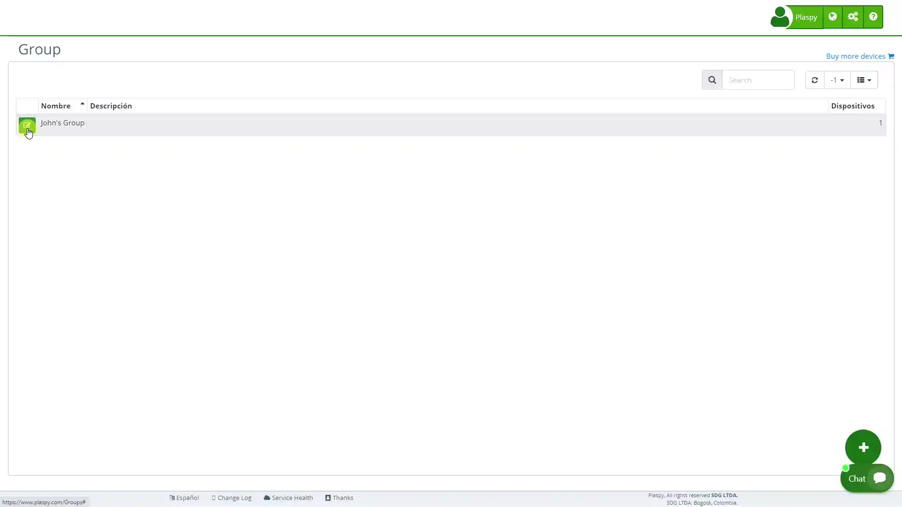

# Embed the map on my website
Embedding the Plaspy map with the position of your devices on your website facilitates real-time visualization of device locations for visitors. This allows users to see the locations without needing direct access to Plaspy, and you can protect this visualization using your own authentication mechanism, independent of Plaspy's login credentials.

Below are the steps to embed the map on your website, showing current information of selected devices from a group.



## Instructions to Embed the Map

### Step-by-Step

To embed the map on your website, follow these steps:

1. **Enable API access for your account:** Follow the instructions to [enable the API](../enable_the_api) in your Plaspy account. This includes generating an API Key.
2. **Enable device access via the API:** Configure the devices you want to display on the map so that they can be accessed via the API.
3. **Create a group with the devices you want to display:** In Plaspy, create a [group](https://app.plaspy.com/Groups) and include all the devices you want to visualize on the map.
4. **Find the Group Identifier:** Edit the created group and copy the group identifier \(Group ID\), which is needed to configure the API.
5. **Embed the HTML code for the map on your website:** Use the following HTML code, replacing `my_group_id` with the group identifier you copied in the previous step:

&lt;div id="map\_canvas" style="width:100%;height:400px"&gt;Cargando...&lt;/div&gt;  
&lt;script type="text/javascript"&gt;plaspy\_api\_group\_key="**my\_group\_id**";&lt;/script&gt;  
&lt;script type="text/javascript" src="https://app.plaspy.com/api/loadMapG.js"&gt;&lt;/script&gt;

```

```

### Integration Example

To see a functional example of this integration, you can refer to the following video: [See functional example](./1-insertar-mapa-en-pagina-web.webp)

## Final Considerations

- **Customization:** Ensure that the map is well integrated into your webpage design, adjusting the size and style as necessary.
- **Security:** Verify that your website is configured to securely handle communication with the Plaspy API.
- **User Experience:** Provide clear and accessible information so that your users understand that they are viewing real-time data from the devices through your site.

Embedding the Plaspy map on your website is an effective way to provide visitors with access to real-time positions of your devices. By following the mentioned steps, you can easily integrate the map using the Plaspy API, facilitating visualization and improving the user experience on your site.
