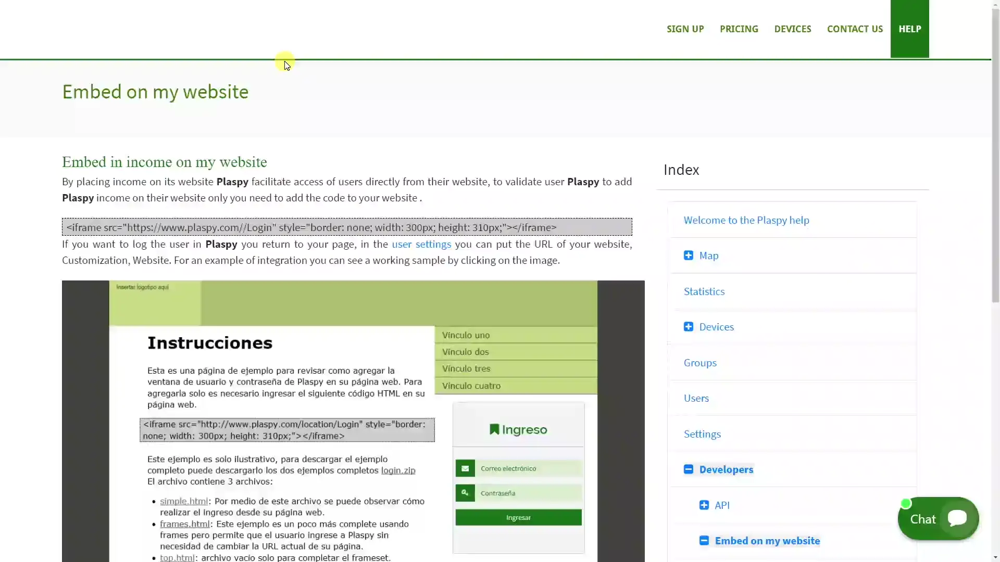

# Embed login on my website
Embedding the login form on your website can facilitate user access, allowing them to log in directly from your site. This improves user experience and centralizes access to from your own webpage. Below are the steps to add the login form using an iframe.

## Instructions to Embed the Iframe

### Step-by-Step

1. **Add the iframe code to your webpage:**
    - Copy the following iframe code and paste it in the location on your webpage where you want the login form to appear.

&lt;iframe src="https://app.plaspy.com/Login" style="border: none; width: 300px; height: 310px;"&gt;&lt;/iframe&gt;
2. **Configure the return to your webpage:**
    - If you want users to return to your webpage after logging out, you can configure the return URL in the user customization section.
    - Go to the user settings and add the URL of your webpage in the corresponding field under "[Customization](https://app.plaspy.com/Settings)" and "Web Page".

## Final Considerations

- **Customization:** Ensure the iframe is well integrated into your webpage design by adjusting the size and style as necessary.
- **Security:** Verify that your website is configured to securely handle communication with the iframe.
- **User Experience:** Provide clear and accessible information so your users understand that they are logging into through your site.

Embedding the login form on your website is an effective way to enhance user experience, allowing them to access directly from your site. By following the mentioned steps, you can easily integrate the login form using an iframe, thus facilitating access and better managing interaction with your users.
