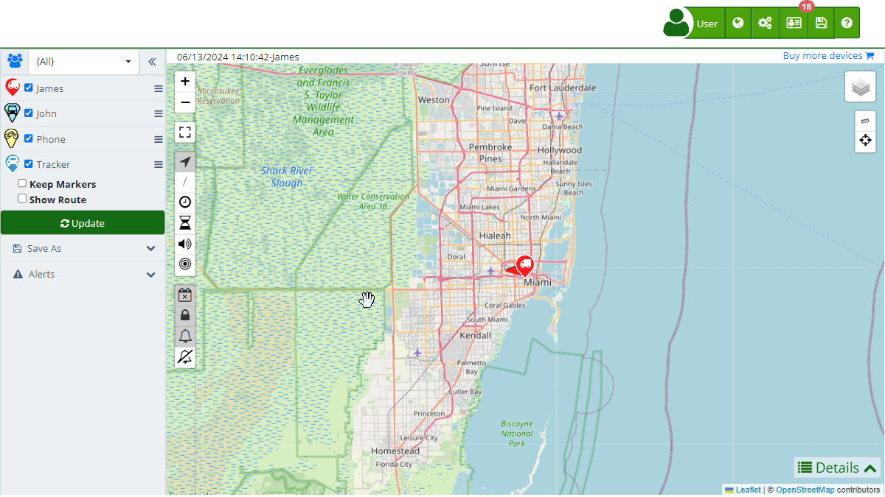

# Enable the API
An API \(Application Programming Interface\) is a set of protocols and tools that allow different software applications to communicate and exchange data. APIs enable applications to interact efficiently and securely, facilitating integration and the development of new functionalities. In the context of Plaspy, the REST API allows developers to access the functionalities of Plaspy's software from their own applications or websites.

Plaspy's REST API provides users with the ability to deeply integrate with the Plaspy system, allowing for customization and extension of tracking and monitoring capabilities according to specific user needs. Below are the steps to enable and use Plaspy's REST API.

## Activating the API

To activate the API service in your Plaspy account, you need to generate an API Key, which will serve as a credential for accessing Plaspy's REST API. Here are the steps required to perform this activation:

### Step-by-Step

1. **Access the Account Section:**

    - Log in to your Plaspy account and navigate to the top right corner.
    - Click on your user name and select "[My Account](https://app.plaspy.com/Account)" from the dropdown menu.
    - You can also access it directly via this [link](https://app.plaspy.com/Account).
2. **Navigate to Account Information:**

    - On the account page, find the " Account Information" section.
    - Within this section, locate the "API Key" option.
3. **Generate the API Key:**

    - Click on the options icon \(\) next to "API Key".
    - Select the " Generate" option from the dropdown menu.
    - This will generate a new access key that you can use to integrate Plaspy's API into your application or website.
4. **Copy and Save the API Key:**

    - Once the API Key is generated, make sure to copy and save it in a secure place. This key will be necessary to authenticate requests to Plaspy's REST API.

### Managing the API Key

- **Delete the API Key:**
    - If you want to delete the API Key, click on the options icon \(\) next to "API Key" and select " Delete". This will revoke access for any user currently using this key.
- **Regenerate the API Key:**
    - You can generate a new API Key at any time. Doing so will automatically invalidate the previous key, and users using the old key will immediately lose access.

## What is an API and What is it Used For?

An API \(Application Programming Interface\) allows different applications to communicate with each other, share data, and functionality in a structured manner. APIs are used for:

- **System Integration:** Allowing different systems and applications to work together seamlessly.
- **Process Automation:** Facilitating the automation of repetitive tasks between different systems.
- **Functionality Extension:** Adding new functionalities to an existing application without modifying the base code.
- **Remote Access:** Allowing access to the functionalities of an application from another application located in a different environment.

In the case of Plaspy, the REST API allows users to access tracking and monitoring functionalities from their own applications, providing a flexible and powerful way to customize and extend Plaspy's software capabilities.

## Additional Considerations

- **Using the API:** With the API Key, you can start creating custom integrations and developments using Plaspy's software capabilities.
- **Security:** Keep your API Key secure and do not share it with unauthorized third parties. Misuse of the key can compromise the security of your data and the services provided by Plaspy.
- **Key Management:** Remember that you can delete or regenerate your API Key at any time, which will automatically invalidate the previous key and block access for any user using it.

## Conclusion

Enabling the API in Plaspy is a straightforward process that allows developers to integrate and customize the software's functionalities within their own domains. By following the steps mentioned, you can generate an API Key and start leveraging all the benefits of Plaspy's REST API integration, enabling deep and flexible integration with the Plaspy system.
