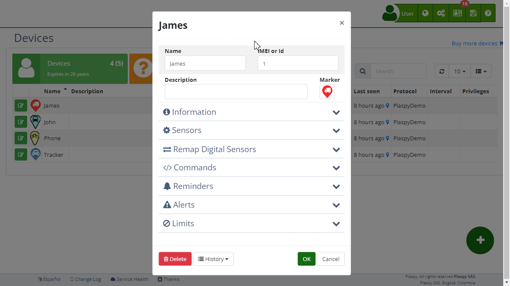

# Configuration
**Notifications** In this section, you can specify the different channels through which you want to receive [alerts](.). The available options include push notifications, Telegram, email, SMS, and WhatsApp. Below are the descriptions of each field and available options:

###   Notifications

- **[Mobile Application](../../mobile_application) \(Push\):** Activate this option to receive push notifications through the Plaspy mobile app. These notifications will appear in the status bar of your mobile device, similar to other app notifications.
- **[Telegram](../../my_account/telegram_accounts):** Select this option to receive alerts via Telegram. Ensure you have configured the integration with Telegram in your Plaspy account beforehand.
- **[Email](../../settings/email_templates):** Check this box to receive notifications via email. Enabling it will activate an additional field to enter the email address where you want to receive the alerts.
- **[SMS](../../sms):** Activate this option to receive notifications via text messages \(SMS\). Upon selecting this option, an additional field will appear where you must enter the phone number in international format \(starting with the plus sign followed by the country code and the number\). It is important to have credit in your Plaspy account to activate this option.
- **WhatsApp:** Select this option to receive notifications through WhatsApp. When you activate this option, you will be asked to enter the phone number associated with your WhatsApp account in international format. As with SMS notifications, you need to have credit in your Plaspy account to activate this option.

###   Schedule

The schedule configuration allows you to define the time intervals during which you want to receive notifications. This feature is useful to avoid receiving alerts outside of your working hours or during the night. Below are the descriptions of the fields in this section:

- **Enable Schedule:** Check this option to enable specific schedule settings for receiving notifications.
- **Start Time:** Define the time from which you want to start receiving notifications. The time format may vary according to your account's regional settings.
- **End Time:** Set the time at which you want to stop receiving notifications. This setting allows you to limit the reception of alerts to a specific period of the day.
- **Days of the Week:** Select the days of the week on which you want to activate the reception of notifications. You can choose one or several days according to your needs.

###   Additional Conditions

Additional Conditions allow you to specify additional criteria that must be met for an alert to be generated. These conditions can be based on various device parameters, providing detailed control over when alerts are triggered. It is important to note that all configured conditions must be met simultaneously for the main alert and additional alerts to be activated.

- **Example:** Suppose you want to receive an alert only if the device moves at more than 80 km/h and is within a specific area called "Control Area." You set the Maximum Speed to 80 km/h and select the "Control Area" Geographical Zone. The alert will only be triggered if both conditions are met simultaneously.
- **Use Case:** Imagine you manage a fleet of vehicles and want to ensure they do not exceed speed limits in school zones. You configure a main alert to detect speeding and add additional conditions so that the alert is only triggered if the vehicle is in a school zone and exceeds 30 km/h. This way, you can monitor and ensure compliance with road safety regulations in sensitive areas.

###   Commands

The [Commands](../commands) section allows you to configure automatic commands that will be sent to the device when certain conditions are met. These commands can perform various actions on the device, improving remote response and management. Commands can be sent via GPRS or SMS according to user preferences. Additionally, you can set a delay in seconds for sending the command or schedule multiple commands with different dates and times. Below are the descriptions of the available fields and options:

- **GPRS or SMS Command:** Specify a command that will be automatically sent to the device when the alert is triggered. This command can be used to remotely control certain functions of the device. You can select the command from a list of available commands for the tracker.
- **Delay in seconds:** Set a delay in seconds for sending the command after the alert has been triggered. This can be useful if you want to give the device time to perform other actions before executing the command.
- **Schedule multiple commands:** Allows you to configure multiple commands that will be sent at different times. Each command can have a specific sending schedule, providing greater flexibility in device management.
- **Example:** If you configure an alert for when a vehicle exceeds 100 km/h, you can schedule a command to cut off the vehicle's engine 10 seconds after the alert is triggered. You can also schedule a second command to send a notification to the driver 5 seconds after the alert is triggered, warning them about the excessive speed.
- **Use Case:** Consider a scenario where you manage a fleet of trucks transporting valuable goods. You configure an alert for when a truck stops for more than 10 minutes in an unauthorized area. When the alert is triggered, you automatically send a command to block the truck's engine after a 60-second delay and another command to notify the company's security team about the situation.

###   Advanced

The Advanced section within the alert editing in Plaspy provides additional options for detailed and specific alert configuration, allowing users to have more granular control over how and when notifications are generated and sent. These advanced configurations are ideal for users who need to customize alerts precisely and complexly.

- **Time Zone:** This field allows you to select the time zone that will be used for the alerts. This ensures that all notifications and events are recorded according to the user's local time. It is especially useful for users managing devices in different geographical locations.
- **Use plain text:** This option, when checked, sends alert notifications in plain text format instead of HTML. It is useful for systems that do not support HTML or when a simpler message format is preferred.
- **Critical alert, Highlight on the map:** When you select this option, the alert will be highlighted on the map, emphasizing its importance. This helps to quickly identify critical alerts that require immediate attention.
- **Notify when the alert is over:** When you activate this option, a notification will be sent when the alert condition has ended. It is useful to keep users informed not only of the start but also of the end of an event.
