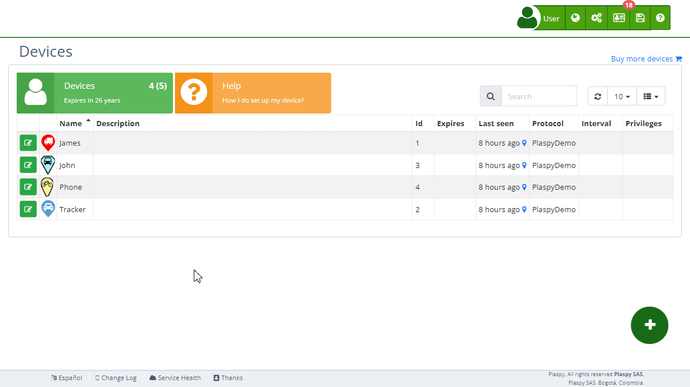

# Alerts
The Alerts section allows users to configure notifications for various events related to their tracking [devices](https://app.plaspy.com/Devices). These alerts are essential for effective monitoring and receiving real-time information about important situations, such as unexpected movements, tracker disconnections, or entering and exiting control zones.

## General Description

Alerts are configurable notifications sent to users to inform them about specific events related to their tracking devices. These alerts help efficiently monitor devices, ensuring real-time notifications for any important event.

### Alert Features

- **Alert Name**: Allows you to identify the configured alert descriptively.
- **Email Notification**: Sends a notification to the specified [email addresses](../email_alerts_sending_limits).
- **Push Notification**: Sends a push notification to the [mobile app](../../mobile_application).
- **Telegram Notification**: Sends a notification via [Telegram](../../my_account/telegram_accounts).
- **WhatsApp Notification**: Sends a notification via WhatsApp.
- **SMS Notification**: Sends a notification via [text message](../../sms).
- **Schedule**: Allows you to set the alert to activate only on certain days or times.

### Buttons and Functions

- **Add Alert**: To create a new alert, click the add alert button \(*fa-plus*\). A form will open where you can enter the details of the new alert.
- **Edit Alert**: To edit an existing alert, click the edit icon \(*fa-pencil-square-o*\) next to the alert you want to modify. A form will open where you can update the alert details.
- **Delete Alert**: To delete an alert, click the delete icon \(*fa-trash*\) next to the alert you want to remove. Confirm the deletion to complete the process.

## Step-by-Step Instructions

### Creating a New Alert

1. Select the [device](https://app.plaspy.com/Devices) for which you want to configure an alert.
2. Click the add alert button \(*fa-plus*\).
3. Complete the necessary fields in the form that opens:
    - **Alert Name**: Enter a descriptive name for the alert.
    - **Email**: Enter the email address to receive the notification.
    - **Email, Push, Telegram, WhatsApp, and SMS Notifications**: Enable or disable as needed.
    - **Schedule**: Set the days and times when the alert should be active.
4. Click "OK" to create the alert.

### Editing an Existing Alert

1. Select the [device](https://app.plaspy.com/Devices) for which you want to edit an alert.
2. Click the edit icon \(*fa-pencil*\) next to the alert you want to modify.
3. Make the necessary changes in the form that opens.
4. Click "OK" to update the alert.

### Deleting an Alert

1. Select the [device](https://app.plaspy.com/Devices) for which you want to delete an alert.
2. Click the delete icon \(*fa-trash*\) next to the alert you want to remove.
3. Confirm the deletion to complete the process.

## Importance of Alerts

Alerts are crucial for maintaining constant monitoring and receiving timely information about any relevant event occurring with your tracking devices. Properly configuring alerts allows you to react quickly to any situation, thus improving the security and efficiency of managing your assets.
