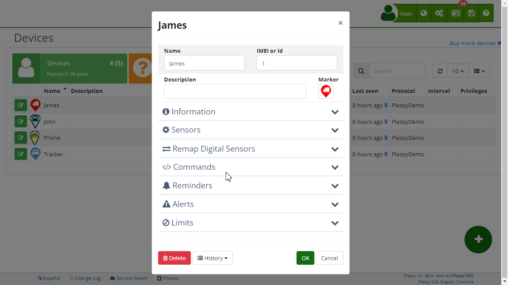

# Types
, the [alert](.) configuration on devices allows users to monitor and manage various events and situations that may occur with their assets. Below are the types of alerts available and how they can be configured for effective tracking.

Once in the alerts section, you can add new alerts by selecting the type of alert that best suits your needs. It is important to note that geo-fences and control points are drawn directly on the map, facilitating the visualization and management of the monitored areas.

### Attributes

[Attributes](../../map/atributes) are non-standard characteristics reported by certain devices and are not common to all locations. These attributes can vary between devices and their availability depends on hardware compatibility and configuration. Attribute-based alerts allow for advanced and specific monitoring. The available alerts in this category are:

- **Location attribute equal to:** This alert is triggered when a specific device attribute, different from the standard location attributes, matches a predefined value. This is useful for monitoring unique device characteristics, such as the state of a specific digital input or the voltage level on an analog sensor.
- **Location attribute greater than:** This alert is triggered when the value of a non-standard device attribute exceeds a set threshold. It can be used to monitor critical conditions where an increase in specific values, such as temperature or voltage, is relevant.
- **Location attribute less than:** Similar to the previous alert, but it is activated when the non-standard device attribute value is less than the defined threshold. Ideal for tracking decreases in specific values, such as fuel level or battery voltage.

### Fuel

Fuel-related alerts are essential for maintaining strict control over vehicle consumption and safety. The available alerts in this category are:

- **Fuel decrease \(%\):** Sends an alert when the fuel percentage decreases by more than a predefined percentage. It is essential for detecting fuel leaks or abnormal fuel consumption in real-time.
- **Fuel decrease 2 \(%\):** Similar to the previous alert, but applied to a second fuel tank or a second fuel monitoring system. Useful in vehicles with multiple tanks.
- **Fuel increase \(%\):** This alert is triggered when there is an increase in the fuel level that exceeds a specified percentage. It is useful for verifying fuel refills and ensuring no errors in refueling.
- **Fuel increase 2 \(%\):** Monitors the increase in the second fuel system, sending an alert when the increase exceeds the set percentage.
- **Fuel less than \(%\):** Sends an alert when the fuel level drops below a specific level. Crucial to avoid vehicles running out of fuel.
- **Fuel 2 less than \(%\):** Similar to the previous alert, but for the second fuel tank. Ensures all fuel systems are adequately monitored.

### General

General category alerts cover a wide range of events that can affect the vehicle's operation and safety. These alerts are essential for daily monitoring and efficient fleet management. The available alerts in this category are:

- **Failed authentication:** Sends an alert when there is a failed authentication attempt on the system. This can indicate unauthorized attempts to access the device or system.
- **Battery voltage less than:** Activated when the vehicle's battery voltage is less than a specific value. This helps prevent issues related to discharged batteries that can affect vehicle operation.
- **SOS button:** Sends an alert when the SOS button is pressed. This type of alert is crucial for emergency situations where immediate assistance is required.
- **Expired date:** Sends an alert when a scheduled date, such as insurance or maintenance expiration, is exceeded. This ensures vehicles stay up-to-date with their legal and maintenance obligations.
- **Idling minutes:** Indicates the total time the vehicle has remained idling. This alert helps monitor and reduce unnecessary fuel consumption and engine wear.
- **Mileage reached \(Km or Miles\):** Sends an alert when a specific mileage is reached. This is useful for scheduling maintenance based on vehicle usage.
- **Low battery:** Activated when the battery level reaches a predefined minimum. Helps ensure devices do not run out of power unexpectedly.
- **Device offline:** Activated when the device disconnects from the servers for some reason and remains offline for a specific time. This is important to detect connectivity issues.
- **RPM limit:** Defines the maximum RPM \(Revolutions Per Minute\) allowed for the engine. Helps prevent overheating and excessive engine wear.
- **Speed less than \(Km/h or Mi/h\):** Defines the minimum speed allowed in Km/h. Useful for monitoring vehicles that must maintain a minimum speed in certain sections.
- **Minutes without movement:** Sends an alert when the vehicle remains stationary for a specific time. This can be useful for detecting unplanned inactivity or security issues.
- **Speed limit \(Km/h or Mi/h\):** Defines the maximum speed allowed in Km/h. Helps prevent speeding and improves vehicle safety.
- **Vibration:** Sends an alert when the tracker's G-Sensor is activated, indicating possible sharp movements or impacts.

### GPS

GPS-related alerts are essential to ensure the proper operation and monitoring of tracking devices. The available alerts in this category are:

- **GPS off:** Sends an alert when the device's GPS is off. This is crucial to ensure continuous tracking.
- **Tracker disconnected:** Sends an alert when the tracker disconnects from the power source. Helps detect possible sabotage attempts or power system failures.
- **GPS no signal:** Notifies when the device's GPS loses signal. This can occur in areas with poor satellite coverage and is important to ensure continuous monitoring.

### Sensors

Sensor-related alerts allow detailed monitoring of the different states and inputs of the vehicle. These alerts are essential to maintain strict control over the vehicle's functionality and condition. The available alerts in this category are:

- **Digital input 1 accumulated active time:** Activated when the accumulated active time of digital input 1 exceeds a predefined value. Useful for monitoring prolonged use of certain electrical systems of the vehicle.
- **Digital input 2 accumulated active time:** Similar to the previous alert, but applied to the second digital input. Allows detailed monitoring of various systems.
- **Digital input 3 accumulated active time:** This alert is activated under the same conditions as the previous ones, but for the third digital input. Helps identify possible problems or inappropriate uses.
- **Digital input 4 accumulated active time:** Monitors the accumulated active time of the fourth digital input. Ideal for vehicles with multiple systems that require supervision.
- **Digital input 1, ACC off:** Sends an alert when the digital input of the ACC \(Access Control Center\) ignition is turned off. Crucial to know when the vehicle has been turned off.
- **Digital input 2 off:** Similar to the previous alert, but applied to the second digital input. Allows monitoring of various digital input points in the vehicle.
- **Digital input 3 off:** Sends an alert when the third digital input is turned off. Useful for vehicles with multiple digital inputs.
- **Digital input 4 off:** Activated when the fourth digital input is turned off. Ideal for monitoring the status of different vehicle systems.
- **Digital input 1, ACC on:** Sends an alert when the digital input of the ACC ignition is turned on. Useful to know when the vehicle has been started.
- **Digital input 2 on:** Similar to the previous alert, but for the second digital input. Allows monitoring of various input points.
- **Digital input 3 on:** This alert is activated when the third digital input is turned on. Helps maintain control over multiple vehicle systems.
- **Digital input 4 on:** Activated when the fourth digital input is turned on. Useful for vehicles with complex systems that require detailed monitoring.
- **Digital input 1 active time:** Monitors the active time of the first digital input, sending an alert when this time exceeds a specific value. Crucial for controlling systems that should not be active for long periods.
- **Digital input 2 active time:** Similar to the previous alert, but applied to the second digital input. Helps maintain control over various systems.
- **Digital input 3 active time:** Sends an alert when the active time of the third digital input is greater than expected. Ideal for detecting anomalies in the vehicle's systems operation.
- **Digital input 4 active time:** Monitors the active time of the fourth digital input, sending an alert if it exceeds the set threshold. Useful for vehicles with multiple systems that require supervision.

### Temperature

Temperature-related alerts are essential to maintain control over the operational conditions of the vehicle, especially in environments where temperature can affect performance and safety. The available alerts in this category are:

- **Temperature greater than:** Sends an alert when the temperature of the vehicle or a specific component rises above a predefined level. This is crucial to avoid overheating and damage to vehicle components.
- **Temperature less than:** This alert is activated when the temperature drops below a specific level. Useful in situations where low temperatures can affect vehicle operation.
- **Temperature 2 greater than:** Similar to the temperature greater alert, but applied to a second temperature sensor. Ideal for vehicles with systems requiring monitoring of multiple temperature points.
- **Temperature 2 less than:** Monitors the second temperature, sending an alert when it drops below a predefined level. Useful for vehicles with multiple temperature-sensitive areas.

### Allowed Zones

This alert is configured to ensure a device remains within a designated area. It is useful for managing assets that must operate within specific geographic limits, such as equipment on a construction site or vehicles within an industrial zone. When the device leaves the allowed zone, an immediate alert is sent.

### Forbidden Zones

The forbidden zones alert is used to prevent devices from entering restricted areas. For example, it can be configured so that a vehicle does not enter dangerous or unauthorized zones. This alert helps prevent unauthorized access and potential security incidents.

### Control Points

Control points are specific locations where the presence of a device needs to be monitored. The alert is activated when the device arrives at or leaves a control point. This is useful for ensuring that vehicles or assets reach critical points in their route, such as loading or unloading stops.

### Control Zones

Control zones are larger areas than control points and are used to monitor the presence of the device in broader geographic areas. These alerts are essential for managing logistics and ensuring that assets remain within the allowed operational limits.
