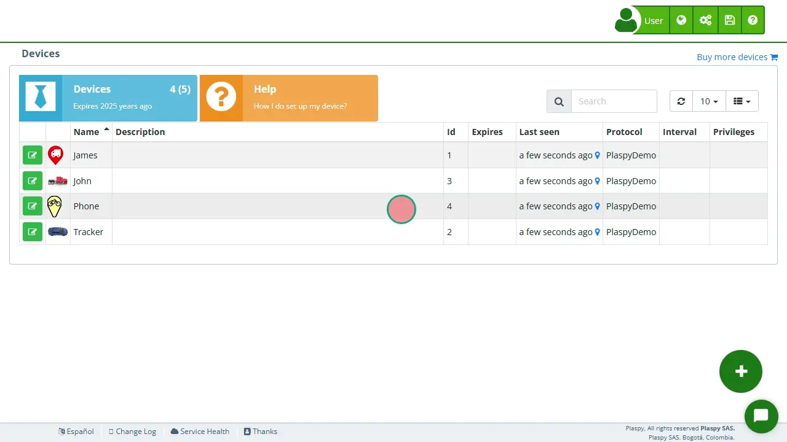

# Certificates
The **Device Certificate** is an official document that confirms a GPS device is active within the satellite tracking service. It displays essential details such as the registered user's name, equipment model, ID, service start date, accumulated usage time, and current account validity. This certificate can be shared with third parties to prove that the device is correctly registered and monitored.

### Step-by-step to generate your certificate

1. **Select the device:** In the **Devices Panel**, choose the equipment for which you want to obtain the certificate.
2. **Access the Information section:** Once selected, a menu will appear with the device's main data. Click on the "*fa-info-circle* **Information**" tab.
3. **Click on "*fa-print* Certificate":** You will find this button at the bottom left of the menu. Simply click there.
4. **Automatic generation and saving:** The system will immediately create the certificate with all the relevant device information. You can then print it or save it to your computer.
