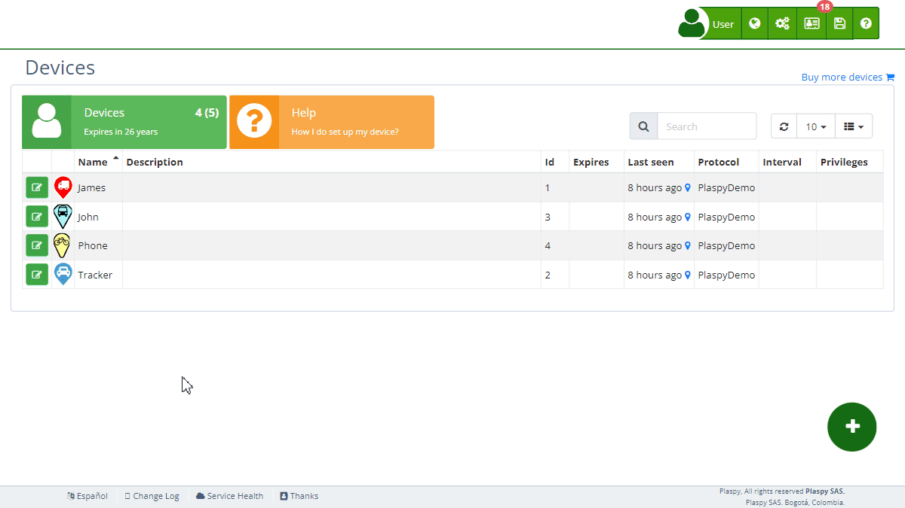

# Commands
The Commands section allows users to configure the available commands for their tracking [devices](https://app.plaspy.com/Devices). This configuration is essential for preparing the devices for specific actions that can be executed later from the map. automatically adds the default commands for the tracker, but users can modify them according to their needs.

## Field Descriptions

- **Command Name**: This field shows the name of the command that will be configured for the device. It can be a specific action like "Cut Power" or "Restore Power".
- **Command Code**: This field contains the exact code that the device will recognize to execute the corresponding action.
- **Command Type**: Indicates the type of command being configured \(SMS, GPRS, Calls\).

## Types of Commands

- **SMS Commands**: These commands are sent as SMS text messages to the tracking device. If the user has SMS balance, the commands will be sent from. Otherwise, they will be sent from the mobile app using the user's mobile phone plan.
- **GPRS Commands**: These commands are sent via the GPRS data network. They are useful for devices with an internet connection, allowing faster and more efficient communication.
- **Call Commands**: These commands initiate a phone call to the device. The call will be opened from the phone's default application with the phone number configured in the tracker.

## Accessing the Commands Section

1. Navigate to the "[*fa-cogs* Devices](https://app.plaspy.com/Devices)" section from the main panel \(*fa-cogs*\).
2. Select the device with the edit icon \(*fa-pencil-square-o*\), next to the device name, for which you want to configure the commands.
3. Click on the "*fa-code* Commands" option to expand this section and view the available commands.

## Step-by-Step Instructions

### Configuring a Command for the Device

1. Select the device from the [device](https://app.plaspy.com/Devices) list with the edit icon \(*fa-pencil-square-o*\), next to the device name.
2. In the "*fa-code* Commands" section, locate the command you want to configure.
3. Review the command name, command code, and command type to ensure it is correct.
4. Click "OK" to save the command configuration for the device.

### Example: Configuring the "Cut Power" Command

1. Select the device from the device list.
2. In the "*fa-code* Commands" section, find the "Cut Power" command.
3. Verify that the command code is "stop123456" and that the command type is SMS.
4. Click "OK" to configure the command for the device.

### Disabling Commands

1. Select the device from the device list.
2. In the "*fa-code* Commands" section, identify the command you want to disable.
3. Click the option to disable the command. This will prevent the command from appearing on the map.
4. Click "OK" to apply the changes.

### Restoring Default Commands

1. Select the device from the device list.
2. In the "*fa-code* Commands" section, delete all configured commands.
3. will automatically re-add the default commands for the tracker.
4. Click "OK" to confirm the restoration of the default commands.

### Saving Commands as a Template

1. Select the device from the device list with the edit icon \(*fa-pencil-square-o*\), next to the device name.
2. Configure the necessary commands.
3. Click "Save command list as".
4. Assign a name to the template and save it. This template can be applied to other devices later to add the commands from the default commands list.

### Checking Sent Commands

1. Navigate to the "Devices" section from the main panel \(*fa-cogs*\).
2. Select the device for which you want to check the sent commands.
3. Click on the "Commands Sent" link to view the command history, including when, who sent them, and the status of the commands.

## Frequently Asked Questions

- **What are commands ?**
    - Commands are specific instructions configured to be sent to tracking devices from the map.
- **How do I know which commands are available for my device?**
    - The list of available commands is shown in the "Commands" section of each device. Review this list to see all the actions you can configure.
- **What should I do if a command does not work?**
    - If a command does not work, verify that the command code is correct and that the device is turned on and connected. If the problem persists, contact technical support.
- **Can I add new commands?**
    - The available commands depend on the capabilities of the tracking device. If you need to add a new command, consult the device documentation or contact technical support for assistance.
- **What types of commands can be configured ?**
    - **SMS**: Text messages sent to the device.
    - **GPRS**: Commands sent via the data network.
    - **Calls**: Initiates a phone call to the device.
- **How are commands sent in plain text or hexadecimal?**
    - Commands can be configured in plain text, if the tracker supports it, or in hexadecimal format, for example, 0x686F6C61 to send "hola". Both options are supported by.
