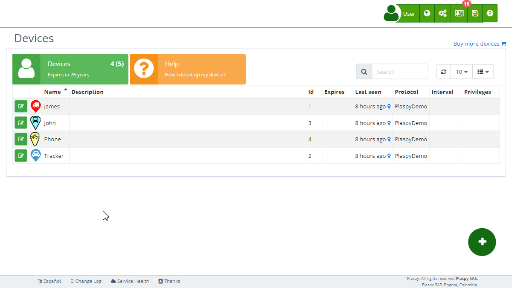

# History
The [device](https://app.plaspy.com/Devices) history functionality allows users to review and restore previous configurations of their tracking devices. This tool is essential for maintaining detailed control and troubleshooting issues that may arise from recent changes. Accessing a device's history is straightforward and provides a comprehensive view of all modifications made, enabling you to restore the device's state to any specific date.

### To access a device's history

1. Go to the "[Devices](https://app.plaspy.com/Devices)" section from the main panel \(*fa-cogs*\).
2. Select the device whose history you want to view.
3. Click on the "*fa-list* History" button to display the menu with available dates.
4. Select the date of interest to view the device's status at that time and, if necessary, restore it.

### Field Descriptions

- **History**: Selecting the history option brings up a menu with the dates of changes made to the device. This allows you to review and restore previous configurations.
- **Date and Time**: Each entry in the history shows the exact date and time when a modification was made. This is useful for identifying when specific changes were made and by whom.
- **Modification Details**: Includes detailed information about the changes made, such as configuration adjustments, commands sent, and changes in sensors or alerts.

### Step-by-Step Instructions

1. **Accessing the History**:

 - In the main panel, navigate to "[*fa-cogs* Devices](https://app.plaspy.com/Devices)" in the top right corner in "*fa-cogs*"
 - Select the device with the edit icon \(*fa-pencil-square-o*\), next to the device name whose history you wish to review.
 - Click on the "*fa-list* History" button to open the date menu.
2. **Reviewing the History**:

 - In the dropdown menu, select the specific date you wish to review.
 - Examine the device details for that date to understand the changes made.
3. **Restoring a Previous Configuration**:

 - Select the desired date in the history.
 - Click on the restore option to revert the device to that state.
 - Confirm the restoration to apply the changes.

### Validations and Restrictions

- **Access**: Only users with appropriate permissions can access and modify the device history.
- **Data Consistency**: When restoring a previous state, ensure that the information is consistent and does not negatively impact the device's operation.
- **Restoration Restrictions**: Some configurations may not be reversible if they involve critical changes to the infrastructure or hardware of the device.

### Frequently Asked Questions

- **What can I see in a device's history?**

 - In the history, you can see all modifications made to the device, including configuration adjustments, commands sent, and changes in sensors or alerts.
- **How can I restore a device to a previous state?**

 - Access the device's history, select the desired date, and use the restore option to revert the device to that state.
- **Who can access the device history?**

 - Only users with appropriate permissions can access and modify the device history.

This functionality is crucial for effective device management, allowing administrators to maintain detailed control and ensure operational continuity without issues.
