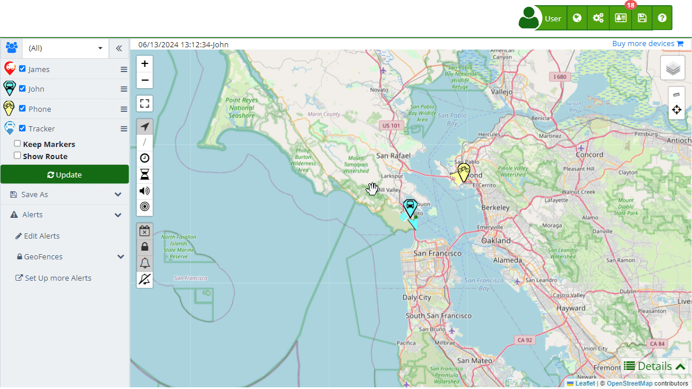

# Devices
The [Devices](https://app.plaspy.com/Devices) section in Plaspy allows you to manage and monitor the satellite tracking devices associated with your account. Here, you can add new trackers, view the status of current ones, and configure various options for each device. This functionality is essential for maintaining precise and up-to-date control of the vehicles, assets, or people you are tracking. To access this section, navigate to "[Devices](https://app.plaspy.com/Devices)" from the main panel.

Plaspy automatically detects the type of device connected to your account, and this information may vary depending on the device. Some examples of device types are: Android, IOS, Xexun, TK103, Ruptela Eco 5, Wanway GS10, among others. This detection is based on the communication protocol used by the tracker and does not necessarily match the brand and model of the device.

**Note for mobile phones:** It is necessary to download our [Plaspy App](../mobile_application) from your mobile device's app store. Once the application is open, log into your account or register with Plaspy, allowing you to add new devices to your tracking service. The Plaspy mobile app offers additional options such as transmission time, the ability to track the phone, or use the app to monitor and control other devices. The app will have permissions for your account deactivated by default; you need to authorize the permissions that fit the desired profile. You can create and configure profiles in the option assigned to the device or user.

## Field Descriptions

- **Name**: This field represents the name of the device and is used to identify it easily within the list of devices. Make sure to use a descriptive and unique name to facilitate identification.
- **IMEI or Identifier**: The IMEI \(International Mobile Equipment Identity\) or unique identifier of the device is crucial for its correct configuration and communication with the Plaspy system. This code usually has 15 digits, although some trackers use the last 11.
- **Description**: Here you can enter additional information that describes the device, such as its location, type of vehicle, or any relevant detail.
- [**Marker Icon**:](marker_icon) Allows you to select a specific icon that will represent the device on the map. This helps to visually differentiate between different types of devices.
- [**Information:**](information) Includes details about the device's creation date, last connection, protocol used, associated phone number, and marker text.
- [**Sensors**:](sensors) Here you can configure and monitor the different sensors associated with the device, such as mileage, fuel consumption, and tank capacity.
- **[Reassign Digital Sensors](reassign_digital_sensors)**[:](reassign_digital_sensors) Option to reassign the device's digital inputs to different functions or purposes.
- [**Commands**:](commands) Allows you to send customized commands to the device, either via GPRS or SMS, and view the history of commands sent.
- [**Reminders**:](reminders) Function to schedule alerts or notices that will arrive by email based on specific dates or mileage.
- [**Alerts**:](alerts) Configuration of notifications that activate based on specific events defined by the user.
- limits Limits**: Sets daily limits for sending emails and SMS from the device.

## Step-by-Step Instructions

### Adding a New Device

1. Access the "[Devices](https://app.plaspy.com/Devices)" section from the main panel in the top right corner in ""
2. Click on "" to add new device in the bottom right corner.
3. Fill in the required fields:
    - **Name**: Enter a descriptive name for the device.
    - **IMEI or Identifier**: Enter the device's IMEI number.
    - **Description**: Add any relevant additional information.
4. Select a [marker](marker_icon) if desired to visually differentiate the device on the map.
5. Configure the [sensors](sensors) and [commands](commands) according to your needs.
6. Schedule [reminders](reminders) and [alerts](alerts) if necessary.
7. Set daily [limits](limits) for emails and SMS.
8. Click "OK" to save the device's configuration.

### Editing an Existing Device

1. In the [device](https://app.plaspy.com/Devices) list, select the device you want to edit by clicking the edit icon \(\) located next to its name..
2. Make the necessary changes in the available fields.
3. Click "OK" to save the changes.

### Deleting a Device

1. In the [device](https://app.plaspy.com/Devices) list, select the device you want to edit by clicking the edit icon \(\) located next to its name.
2. Click on ' Delete' in the bottom left corner.
3. Confirm the deletion of the device.

### Adding a Mobile Phone

1. Download and install the [Plaspy mobile](../mobile_application) app from your mobile device's app store.
2. Open the app and log into your Plaspy account.
3. Navigate to the add device section within the mobile app.
4. Follow the on-screen instructions to add your mobile phone as a tracking device.

## Validations and Restrictions

- **Name**: Required field. Must be unique and descriptive.
- **IMEI or Identifier**: Required field. Must contain a valid 15 or 11-digit number.
- **Description**: Optional field, but recommended for better tracking and organization.
- **Marker**: Optional selection to facilitate visual identification.
- **Commands**: When sending commands, ensure they are compatible with the device's protocol.
- **Limits**: Set realistic limits to avoid exceeding the daily capacity of emails and SMS.

## Frequently Asked Questions

- **What is the IMEI and why is it important?**
    - The IMEI \(International Mobile Equipment Identity\) is a unique number that identifies a mobile device. It is crucial for the configuration and communication with the Plaspy tracking system, ensuring that the data sent and received corresponds to the correct device.
- **Can I change the name of a device after adding it?**
    - Yes, you can edit the device's name and other details at any time from the Devices section.
- **How can I add a new custom marker?**
    - When selecting the [marker option](marker_icon), you can choose from the available icons or upload a new one from your device to customize the map's visualization.
- **What type of alerts can I configure?**
    - You can configure [alerts](alerts) for specific events such as when the device disconnects, crosses a control zone, or needs maintenance. These alerts can be received by email, push notifications, Telegram, among others.
- **How do I add a mobile phone as a tracking device?**
    - Mobile phones can only be added directly from the Plaspy [mobile app](../mobile_application). Download the app from your mobile device's app store and follow the instructions to add the phone as a device.
