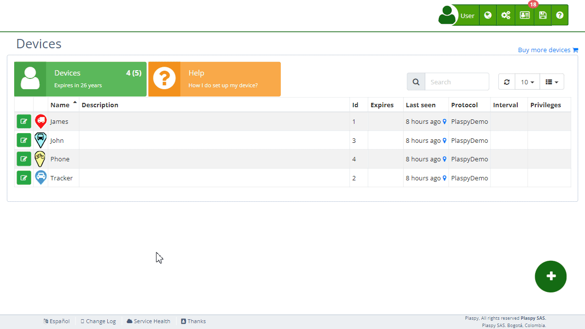

# Information
The [Device](https://app.plaspy.com/Devices) Information section in Plaspy provides key details about the status and characteristics of the selected device. This information is crucial for effectively monitoring and managing each device in your account. Here you will find data such as the device's creation date, last connection, protocol used, associated phone number, and more.

## Field Descriptions

- **Creation**: This field shows the date and time when the device was added to your Plaspy account. This information is useful for tracking how long the device has been in use.
- **Last Connection**: Indicates the date and time of the last time the device connected to the Plaspy network. This helps you verify if the device is active and functioning correctly.
- **Protocol**: Displays the communication protocol used by the device. Plaspy automatically detects the protocol, but if there are similar or compatible protocols for your device, a list of compatible protocols will appear. Usually, Plaspy detects the tracker protocols, and it is not necessary to modify it in most cases.
- **Phone Number**: If your device is associated with a phone number, this section will show the corresponding number. This number is crucial for devices that send and receive data via mobile networks.
- **Marker Text**: Additional information that will be displayed on the device marker on the map. You can use this field to add important notes or specific information that you need to visualize quickly.
- **Tags**: Allows the user to enter custom tags that describe relevant information about the device, such as its location, vehicle type, or maintenance notes. Tags help organize and better control your devices.
- [***fa-print* Certificate**:](certificates) Generates an official Plaspy certificate for the device, indicating relevant information that you can provide to third parties to show that the device is being tracked by Plaspy.
- ***fa-bug* Debug Device**: This option allows you to check the tracker’s connection in Plaspy in real-time. The information is displayed raw and, if possible, in text format. If not possible, it will be shown in hexadecimal format, for example, 0x686F6C61 for binary information.

## Accessing the Device Information Section

1. Navigate to the "[Devices](https://app.plaspy.com/Devices)" section from the main panel in the top right corner in "*fa-cogs*."
2. Select the device for which you want to view information with the edit icon \(*fa-pencil-square-o*\), next to the device name.
3. Click on the "*fa-info-circle* Information" option to expand this section and see the relevant details.

## Step-by-Step: Checking Device Information

### Viewing the Creation Date

1. Select the device from the [device](https://app.plaspy.com/Devices) list.
2. In the "*fa-info-circle* Information" section, look for the field labeled "Creation".
3. Here you will see the exact date and time when the device was added to your account.

### Verifying the Last Connection

1. Select the [device](https://app.plaspy.com/Devices) in question.
2. Within the "*fa-info-circle* Information" section, locate the "Last Connection" field.
3. This field will show when the device last connected, which is useful for ensuring it is operational.

### Checking the Protocol Used

1. Select the [device](https://app.plaspy.com/Devices) from the list.
2. Expand the "*fa-info-circle* Information" section and find the "Protocol" field.
3. You will see the protocol that the device uses to communicate with Plaspy. If there are similar or compatible protocols, a list of options will appear. Usually, it is not necessary to modify the protocol detected by Plaspy.

### Reviewing the Associated Phone Number

1. Select the desired [device](https://app.plaspy.com/Devices).
2. In the "*fa-info-circle* Information" section, look for the "Phone Number" field.
3. Here, the associated phone number will be displayed, if applicable.

### Viewing the Marker Text

1. Select the device from the list.
2. In the "*fa-info-circle* Information" section, locate the "Marker Text" field.
3. Here you can add or edit the text that will be displayed on the device marker on the map.

### Adding and Managing Tags

1. Select the device from the list.
2. Expand the "*fa-info-circle* Information" section.
3. Enter the tags that describe relevant information about the device, such as "Customer John", "Pays monthly", etc.
4. Click "OK" to apply the tags to the device.

### Generating a Certificate

1. Select the device from the list.
2. In the "*fa-info-circle* Information" section, look for the "*fa-print* Certificate" option.
3. Click it and the system will create the certificate immediately.
4. The certificate will include relevant information about the device and will be ready to be provided to third parties.

### Debugging a Device

1. Select the device from the list.
2. In the "*fa-info-circle* Information" section, look for the "*fa-bug* Debug Device" option and click it.
3. The tracker’s connection will be checked in real-time, showing the information raw. If possible, the information will be shown in text format; otherwise, it will be displayed in hexadecimal format.

## Frequently Asked Questions

- **Why is the device's creation date important?**
    - Knowing the creation date helps you track how long the device has been in use and plan for maintenance or replacements.
- **What should I do if the device's last connection is old?**
    - If the last connection is old, check the device's status, network coverage, and ensure it is turned on and correctly configured.
- **How do I know if the device protocol is correct?**
    - The protocol should match the type of device and its configuration. Plaspy automatically detects the protocol, and in most cases, it is not necessary to modify it.
- **What should I do if the phone number is incorrect?**
    - If the associated phone number is incorrect, edit the device's settings and update the number. Ensure the device uses the correct number for data transmission.
- **How can I use the marker text?**
    - The marker text allows you to add visible notes directly on the device marker on the map, which can facilitate quick identification and management of devices.
- **How do tags help me?**
    - Tags allow you to organize and describe your devices better, making administration and control easier.
- **What is the Plaspy Certificate, and what is it for?**
    - The Plaspy Certificate is a document that you can generate to show third parties that the device is being tracked by Plaspy. It includes relevant information about the device.
- **What does it mean to debug a device?**
    - Debugging a device involves checking its connection in real-time, showing the information raw. This can help you identify connection or configuration issues.
