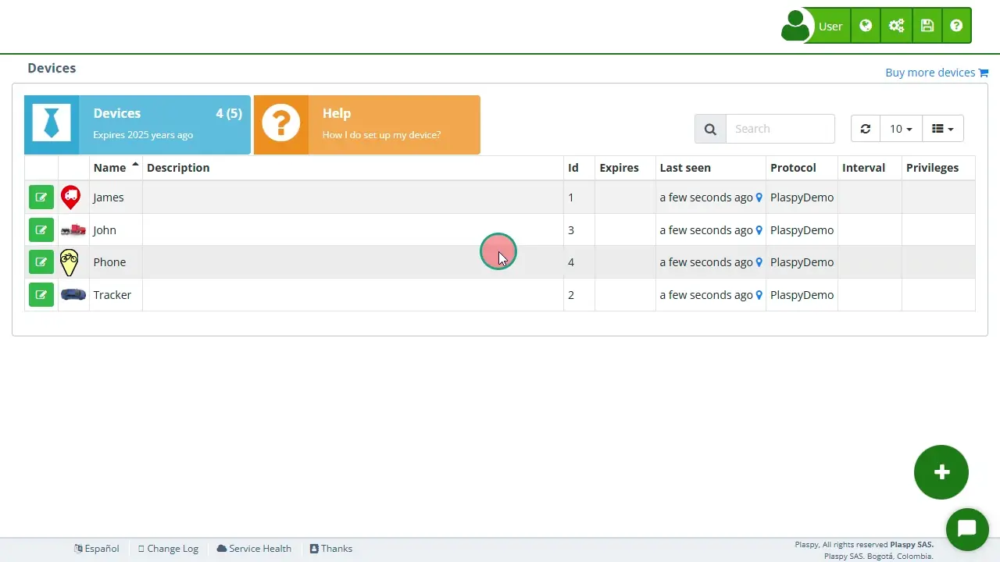

# Limits
The Limits section allows users to set daily restrictions for [sending emails](email_alerts_sending_limits) and [SMS messages](../sms) from their tracking [devices](https://app.plaspy.com/Devices). This functionality is essential for managing resource usage and preventing excessive communications, which can be useful for controlling costs and ensuring compliance with usage policies.

## Field Descriptions

- **Expires**: Option to set an expiration date for the configured limits. When activated, you must enter a specific expiration date. When a device expires, it will no longer count as a used license. For example, if you have 10 licenses with 10 devices and one of them expires, one license will become available for a new device. The expired device cannot be reactivated if there are no available licenses.
- **Daily Email Limit**: The maximum number of emails that can be sent from the device in a day. This limit helps control excessive use of emails.
- **Daily SMS Limit**: The maximum number of SMS messages that can be sent from the device in a day. This limit is useful for managing SMS usage and controlling associated costs.

## Accessing the Limits Section

1. Navigate to the "[*fa-cogs* Devices](https://app.plaspy.com/Device)" section from the main panel \(*fa-cogs*\).
2. Select the device with the edit icon \(*fa-pencil-square-o*\), next to the device name for which you want to configure the limits.
3. Click on the "*fa-ban* Limits" option to expand this section and view the relevant details.

## Step-by-Step Instructions

### Setting Daily Limits

1. Select the device from the [device](https://app.plaspy.com/Devices) list with the edit icon \(*fa-pencil-square-o*\), next to the device name.
2. In the "*fa-ban* Limits" section, locate the "Daily Email Limit" and "Daily SMS Limit" fields.
3. Enter the desired values for the daily email and SMS limits.
4. If you want to set an expiration date for these limits, activate the "Expires" option and select an expiration date in the corresponding field.
5. Click "OK" to apply the configured limits to the device.

### Example: Setting a Daily Limit of 10 Emails and 5 SMS

1. Select the device from the device list.
2. In the "*fa-ban* Limits" section, enter "10" in the "Daily Email Limit" field.
3. Enter "5" in the "Daily SMS Limit" field.
4. \(Optional\) If you want these limits to expire on a specific date, activate the "Expires" option and select the expiration date.
5. Click "OK" to apply the configured limits.

### Checking Limit Usage

1. Select the device from the device list.
2. In the "*fa-ban* Limits" section, review the counters indicating the number of emails and SMS messages sent that day.
3. Adjust the limits if necessary, based on the recorded usage.

## Frequently Asked Questions

- **Why is it important to set daily email and SMS limits?**
    - Setting daily limits helps control excessive communications, reducing costs and ensuring compliance with usage policies.
- **What happens when the configured daily limit is reached?**
    - Once the configured daily limit is reached, no more emails or SMS messages can be sent from the device until the next day.
- **Can I change the daily limits after configuring them?**
    - Yes, you can adjust the daily limits at any time from the device's Limits section.
- **Is it mandatory to set an expiration date for the limits?**
    - No, setting an expiration date is optional. You only need to activate it if you want the configured limits to be temporary.
- **What happens when a device expires?**
    - When a device expires, it will no longer count as a used license. For example, if you have 10 licenses with 10 devices and one of them expires, one license will become available for a new device. The expired device cannot be reactivated if there are no available licenses.
