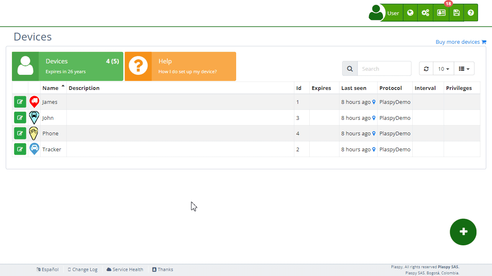

# Marker Icon
Changing the marker icon allows you to customize how your [devices](https://app.plaspy.com/Devices) are visually represented on the map. This can be particularly useful for differentiating between different types of devices or for aligning the map view with your specific needs.

## Accessing the Marker Icon Settings

1. Navigate to the "[*fa-cogs* Devices](https://app.plaspy.com/Devices)" section from the main panel in the top right corner in "*fa-cogs*".
2. Select the device for which you want to change the marker icon with the edit icon \(*fa-pencil-square-o*\), next to the device name.
3. Click on the "Marker" field in the device's settings. This will open the marker icon selection window.

## Choosing a New Marker Icon

### Steps to Select a Predefined Marker Icon

1. **Icon Selection**: In the marker icon selection window, you will see various icons displayed in a grid format.
2. **Browse Icons**: Scroll through the available icons. Icons are categorized based on different shapes and colors.
3. **Select Icon**: Click on the icon you wish to use. The selected icon will be highlighted.
4. **Confirm Selection**: Click "OK" or the equivalent button to confirm your selection. The new icon will now represent your device on the map.

### Customizing Icon Colors

1. **Icon Color**: Below the icon selection grid, there are options to customize the icon color.
 - Locate the "Icon" section.
 - Use the color picker to select a new color for the icon.
 - The selected color will be applied to the icon.
2. **Text Color**: Similarly, you can customize the text color that appears within or alongside the icon.
 - Locate the "Text" section.
 - Use the color picker to select a new text color.
 - The selected color will be applied to the text on the icon.

### Adding Text to the Icon

1. **Text Input**: You can add text to the icon for further customization.
 - Locate the "Text" field.
 - Enter the desired text \(up to 8 characters\).
 - The text will appear on the icon.

### Icon Types

1. **3D Icons**: These icons have a three-dimensional appearance and can rotate in 3D.
2. **2D Icons**: These icons rotate from a top-down perspective.
3. **Static Icons**: These icons are fixed in position and viewed from the side.
4. **Default Icons**: Standard icons provided by the system.

Switch between icon types by clicking on the respective tabs at the top of the icon selection window.

### Uploading Custom Icons

1. **2D and Static Icons**: In addition to selecting predefined icons, you can upload your own custom icons of the 2D and static types.
2. **Upload Icon**:
 - Navigate to the tab corresponding to 2D or static icons.
 - Click on the "Upload Icon" button.
 - Select the icon file from your device. Ensure that the file is in a compatible format \(e.g., PNG or SVG\).
 - Once uploaded, the new icon will appear in the list of available icons.
3. **Select and Confirm**: Select your custom icon from the list and click "OK" to apply it to the device.

## Saving the Changes

1. After selecting and customizing your marker icon, click on the "OK" button to save the changes.
2. The new marker icon will now be displayed on the map for the selected device.

## Frequent Asked Questions

- **Can I upload a custom marker icon?**
 - Yes, The platform allows you to upload custom icons of the 2D and static types. Follow the mentioned steps to upload and apply your custom icon.
- **What if I change my mind about the icon?**
 - You can change the marker icon as many times as you like. Simply follow the steps above to select a new icon.
- **How does the text on the icon help?**
 - Adding text to the icon can help in quickly identifying specific devices on the map, especially when dealing with multiple devices.
