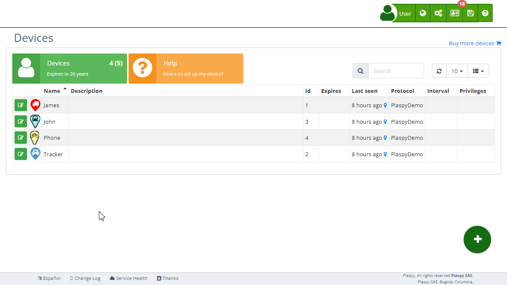

# Reassign Digital Sensors
The reassign digital sensors function in Plaspy allows you to change the assignment of the tracker’s digital inputs to different functions or purposes. This is useful for adjusting the configuration of [devices](https://app.plaspy.com/Devices) according to specific monitoring and control needs.

## Field Descriptions

- **Digital Input 1 \(ACC\)**: Allows you to reassign digital input number 1 of the tracker, which typically monitors the ignition status \(ACC\), to another function.
- **Digital Input 2**: Allows you to reassign digital input number 2 of the tracker to another function.
- **Digital Input 3**: Allows you to reassign digital input number 3 of the tracker to another function.
- **Digital Input 4**: Allows you to reassign digital input number 4 of the tracker to another function.

## Accessing the Reassign Digital Sensors Section

1. Navigate to the "[*fa-cogs* Devices](https://app.plaspy.com/Devices)" section from the main panel \(*fa-cogs*\).
2. Select the device with the edit icon \(*fa-pencil-square-o*\), next to the device name for which you want to reassign the digital sensors.
3. Click on the "*fa-exchange* Reassign Digital Sensors" option to expand this section and view the relevant details.

## Step-by-Step Instructions

### Reassigning a Digital Input

1. Select the device from the [device](https://app.plaspy.com/Devices) list.
2. In the "*fa-exchange* Reassign Digital Sensors" section, locate the digital input you want to reassign.
3. Click on the dropdown menu next to the digital input field.
4. Select the new function to which you want to reassign the digital input.
5. Click "OK" to update the reassignment.

### Example: Reassigning Digital Input 1 \(ACC\)

1. Select the device from the device list.
2. In the "*fa-exchange* Reassign Digital Sensors" section, locate the "Digital Input 1 \(ACC\)" field.
3. Click on the dropdown menu and select the new function, for example, "Digital Input 2".
4. Click "OK" to update the reassignment.

## Frequently Asked Questions

- **Why should I reassign a digital input?**
    - Reassigning a digital input allows you to adapt the device configuration to your specific monitoring and control needs. For example, you can change the function of a digital input to monitor a different sensor or activate a specific function.
- **How do I know which function to select for a digital input?**
    - The function to select depends on your specific monitoring needs. If you are unsure, consult the device documentation or contact Plaspy technical support for recommendations.
- **What happens if I incorrectly reassign a digital input?**
    - If you incorrectly reassign a digital input, the device might not function as expected. You can return to the reassign digital sensors section and select the correct function to fix the configuration.
