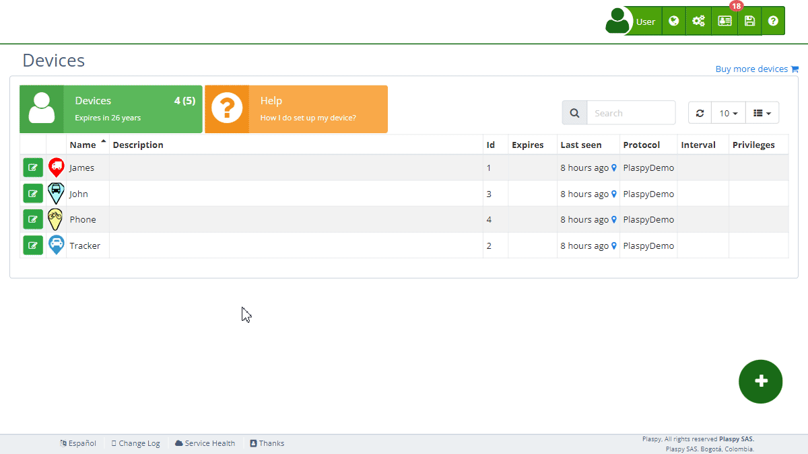

# Reminders
The Reminders section allows users to schedule [alerts](alerts) for important events related to their tracking [devices](.). These alerts can be based on specific dates or the vehicle's mileage, and are sent via email to ensure that critical tasks, such as vehicle maintenance, are not forgotten.

## Field Descriptions

- **Reminder Name**: This field allows you to assign a descriptive name to the reminder, such as "Vehicle Maintenance" or "Insurance Renewal".
- **Email**: The email address where the reminder will be sent. You can add one or multiple addresses separated by commas.
- **Date**: The date on which you want the reminder to be sent. Use the date picker to select the correct date.
- **Mileage**: The mileage at which you want the reminder to be sent. Enter the value in kilometers.

## Accessing the Reminders Section

1. Navigate to the "[Devices](https://app.plaspy.com/Device)" section from the main panel.
2. Select the device for which you want to configure a reminder.
3. Click on the "Reminders" option to expand this section and view the relevant details.

## Step-by-Step Instructions

### Creating a New Reminder

1. Select the device from the [device](.) list with the edit icon \(*fa-pencil-square-o*\), next to the device name.
2. In the "*fa-bell* Reminders" section, fill the reminder template.
3. Complete the required fields:
    - **Reminder Name**: Enter a descriptive name for the reminder.
    - **Email**: Enter the email address where you want to receive the reminder.
    - **Date**: Select the date on which you want the reminder to be sent.
    - **Mileage**: Enter the mileage at which you want the reminder to be sent.
4. Click "OK" to create the reminder.

### Editing an Existing Reminder

1. Select the device from the device list with the edit icon \(*fa-pencil-square-o*\), next to the device name.
2. In the "*fa-bell* Reminders" section, locate the reminder you want to edit.
3. Make the necessary changes to the available fields.
4. Click "OK" to update the reminder.

### Deleting a Reminder

1. Select the device from the device list.
2. In the "*fa-bell* Reminders" section, locate the reminder you want to delete.
3. Click on the trash icon \(*fa-trash-o*\) next to the reminder.
4. Confirm the deletion of the reminder.

## Frequently Asked Questions

- **What types of events can I schedule with reminders?**
    - You can schedule reminders for any important event related to your tracking devices, such as vehicle maintenance, insurance renewal, or any other critical task.
- **Can I add multiple email addresses to receive the reminder?**
    - Yes, you can add multiple email addresses separated by commas so that several people receive the reminder.
- **How does the mileage-based reminder work?**
    - The mileage-based reminder will be sent when the vehicle reaches the specified mileage. This is useful for scheduling maintenance based on the vehicle's usage.
- **Can I edit or delete a reminder after creating it?**
    - Yes, you can edit or delete a reminder at any time from the device's Reminders section.
