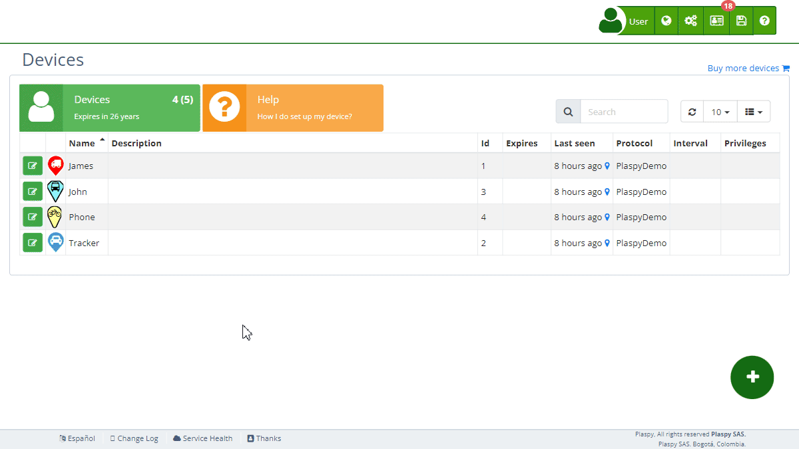

# Sensors
The Sensors section allows you to configure and monitor various sensors associated with your tracking [devices](https://app.plaspy.com/Devices). This functionality is crucial for obtaining detailed and accurate data about your assets, such as mileage, fuel consumption, and tank capacity. Sensors can also include digital inputs and outputs for more specific control and monitoring.

## Field Descriptions

- **[Mileage](../map/mileage_calculation)**: This field sets the current calculated mileage of the vehicle. Enter the vehicle's mileage to keep track of its usage accurately.
- **Fuel Consumption**: This field estimates the approximate fuel consumption to calculate an estimated consumption rate when the device does not have a fuel sensor. This value is used to make summary calculations of trips, based on the distance traveled to estimate fuel consumption.
- **Tank Capacity**: Specifies the fuel tank capacity of the vehicle to perform fuel calculations. Enter the tank capacity in gallons.
- **Digital Input 1 \(ACC\)**: Name of the tracker’s digital input number 1. This input typically monitors the ignition status \(ACC\). The accumulated time of the sensor is displayed next to its title.
- **Digital Input 2**: Name of the tracker’s digital input number 2. The accumulated time of the sensor is displayed next to its title.
- **Digital Input 3**: Name of the tracker’s digital input number 3. The accumulated time of the sensor is displayed next to its title.
- **Digital Input 4**: Name of the tracker’s digital input number 4. The accumulated time of the sensor is displayed next to its title.
- **Digital Output 1**: Name of the tracker’s digital output number 1.
- **Digital Output 2**: Name of the tracker’s digital output number 2.
- **Digital Output 3**: Name of the tracker’s digital output number 3.
- **Digital Output 4**: Name of the tracker’s digital output number 4.

## Accessing the Sensors Section

1. Navigate to the "[*fa-cogs* Devices](https://app.plaspy.com/Device)" section from the main panel in the top right corner in "*.*"
2. Select the device with the edit icon \(*fa-pencil-square-o*\), next to the device name for which you want to configure or monitor sensors
3. Click on the "*fa-cog* Sensors" option to expand this section and view the relevant sensor details.

## Step-by-Step Instructions

### Setting the Mileage

1. Select the device from the [device](https://app.plaspy.com/Devices) list with the edit icon \(*fa-pencil-square-o*\), next to the device name.
2. In the "*fa-cog* Sensors" section, locate the "Mileage" field.
3. Enter the current mileage of the vehicle.
4. Click "OK" to update the mileage.

### Configuring Fuel Consumption

1. Select the device from the device list with the edit icon \(*fa-pencil-square-o*\), next to the device name.
2. In the "*fa-cog* Sensors" section, locate the "Fuel Consumption" field.
3. Enter the approximate fuel consumption value.
4. Click "OK" to update the fuel consumption rate.

### Setting the Tank Capacity

1. Select the device from the device list with the edit icon \(*fa-pencil-square-o*\), next to the device name.
2. In the "*fa-cog* Sensors" section, locate the "Tank Capacity" field.
3. Enter the tank capacity in gallons or liters.
4. Click "OK" to update the tank capacity.

### Configuring Digital Inputs and Outputs

1. Select the device from the device list with the edit icon \(*fa-pencil-square-o*\), next to the device name.
2. In the "*fa-cog* Sensors" section, locate the digital input or output you want to configure.
3. Enter the name for the digital input or output. You can rename digital inputs and outputs to easily identify them, for example, as doors, air conditioning, ignition, etc.
4. Click "OK" to update the digital input or output configuration.
5. To reset a sensor’s state, click the refresh icon next to the respective sensor. This will reset the accumulated time of the sensor to zero and deactivate it until the tracker sends information again to.

## Frequently Asked Questions

- **Why is setting the mileage important?**
    - Accurately setting the [mileage](../map/mileage_calculation) helps in tracking the vehicle's usage, scheduling maintenance, and calculating fuel consumption.
- **What should I do if my vehicle's fuel consumption changes?**
    - Update the "Fuel Consumption" field with the new estimated value to ensure accurate fuel consumption calculations.
- **How does the tank capacity affect fuel calculations?**
    - The tank capacity is used to calculate the fuel levels and consumption more accurately. Ensure this value is correct to avoid miscalculations.
- **What are digital inputs and outputs used for?**
    - Digital inputs and outputs are used for monitoring and controlling specific functions of the device, such as ignition status or activating/deactivating certain components. You can rename them for easier identification.
- **What happens when I reset a sensor's state?**
    - Resetting a sensor’s state will set its accumulated time to zero and deactivate the sensor until the tracker sends information again to.
