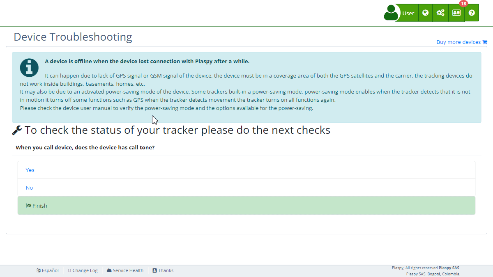

# Device Issues
In Plaspy, you might encounter some [common issues](https://app.plaspy.com/TroubleShooting) with your tracking devices. This guide provides a general overview of these problems and their possible solutions to help you resolve them efficiently.

## Introduction

Sometimes, a tracking device may appear offline, stop transmitting data, or not function correctly due to various reasons. The most common problems are usually related to GPS signal, GSM connectivity, battery status, or device configuration.

## Common Issues and Solutions

### Issue: Device Appears Offline

**Possible Cause: Insufficient GPS or GSM Signal**

- **Solution**: Ensure the device is in an area with good GPS and GSM coverage. Trackers do not work well inside buildings, basements, or areas with many obstructions. Move the device to an open area.

**Possible Cause: Power Saving Mode Activated**

- **Solution**: Check the device's user manual to verify the power-saving options. Some trackers disable certain functions when they do not detect movement. Deactivate the power-saving mode if necessary.

### Issue: The Device Does Not Respond to Calls

**Possible Cause: Lack of Power or Low Battery**

- **Solution**: Ensure the device is properly connected to a power source and that the battery is charged. If needed, fully charge the device before trying again.

**Possible Cause: Device is Turned Off**

- **Solution**: Ensure the device is turned on. Refer to the manual to locate and use the power button if necessary.

**Possible Cause: SIM Card Issues**

- **Solution**: Ensure the SIM card is properly inserted and activated. Make sure it has sufficient balance and an active plan that allows navigation and sending text messages.

### Issue: Incorrect Location or Date

**Possible Cause: Weak GPS Signal**

- **Solution**: Place the device in an open area where it can receive a strong GPS signal. Avoid using it indoors or near large structures that can block the signal.

**Possible Cause: Incorrect Time Zone**

- **Solution**: Ensure the device is set to the correct time zone \(GMT or UTC-0\). Check the device's internet connection so it can synchronize the correct date and time.

### Issue: The Device Does Not Send Data

**Possible Cause: Inactive Data Connection**

- **Solution**: Verify that the mobile data plan with your operator is active and allows navigation. Contact your mobile service provider for more information.

**Possible Cause: Incorrect Configuration**

- **Solution**: Check the device's manual or contact the device provider to ensure it is correctly configured to send data. Some devices may require specific commands for configuration.

## Additional Recommendations

- **Restart the Device**: Some devices may temporarily lock up. Attempting a physical restart can resolve the issue.&lt;
- **Consult the User Manual**: It is always helpful to review the device's manual for specific solutions and configuration options.
- **Technical Support**: If problems persist, contact Plaspy's technical support for further assistance.

By following these tips and solutions, you can resolve most common issues with your tracking devices in Plaspy, ensuring continuous and efficient operation.
