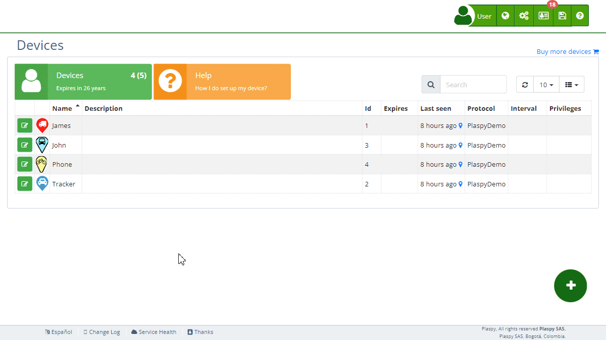

# Setting Up a New Tracker
To start using a new tracker, you need to follow some [configuration](https://app.plaspy.com/Start?w=1) steps. Below are the instructions for setting up your tracker, either through SMS commands or using the software provided by the tracker manufacturer.

### Step 1: Access Tracker Configuration

1. **Start Configuration**: Log into your account and go to the [**Devices**](https://app.plaspy.com/Devices) section and click on [How I do set up my device?](https://app.plaspy.com/Start?w=1)
2. **Select Device Type**: Choose the type of device you want to configure \(tracker or mobile device\).
3. **Add Device Details**:
 - **Name**: Enter a name for your tracker.
 - **IMEI or ID**: Enter the IMEI number or the tracker identifier. This number is usually the 15-digit IMEI, but some trackers use the last 11 digits of the IMEI or a unique serial number. Refer to the user manual for more details.

### Step 2: Configure the APN

1. **Configure APN**: Select the country and the operator of the SIM card inserted in the tracker. will automatically provide the correct APN configuration based on the selected operator.

### Step 3: Configure the Tracker

Select the brand of your tracker. Trackers can be configured using SMS commands or the software provided by the manufacturer. Not all trackers have both options, and users can choose their preferred method.

1. **SMS Commands**: If your tracker requires configuration via SMS commands, will display the specific commands needed for your device. It is important to send the commands exactly as shown, respecting signs, spaces, uppercase, lowercase, etc.
2. **Manufacturer's Software**: Some trackers can be configured using the software provided by the manufacturer. Refer to the user manual to download and install the appropriate software and follow the configuration instructions.

### Step 4: Verification and Completion

1. **Add Device to Account**: Once the tracker is configured, add it to your account by entering the IMEI or unique identifier of the device in the **Devices** section.
2. **Verify Operation**: Ensure the device is sending data correctly and appears on the map.

### Server Information

To connect your tracker to, use the following server details:

- **Server**: `d.plaspy.com` or `54.85.159.138`
- **Port**: `8888`

 will automatically detect the device protocol.

### Troubleshooting

- **Review User Manual**: Refer to the tracker’s user manual for specific information on configuration and troubleshooting.
- **Check Connection**: Ensure the SIM card is activated and has sufficient balance to send data.
- **Restart Device**: If the tracker is unresponsive, try restarting it.

### Additional Assistance

If you encounter issues during the configuration, contact technical support for additional help. They can provide specific guidance and resolve any issues you may have.

By following these steps, you will be able to configure your new tracker and start using its satellite tracking services efficiently and effectively.
