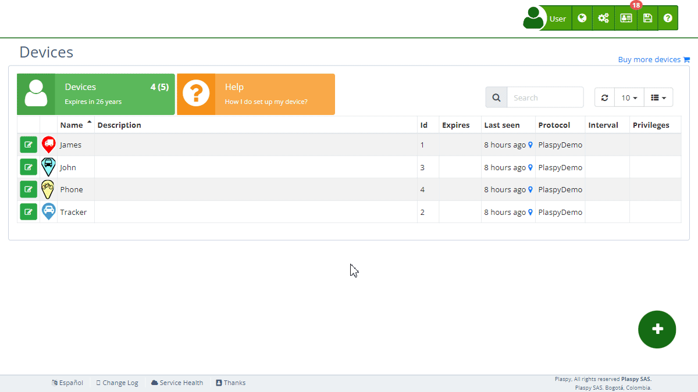

# Solution for Identifier Already in Use by Another Account
If you receive a message indicating that the identifier or serial number is already in use by another account when trying to add your device to your account, you can follow these steps to resolve the issue.

### Reconfiguring the Tracker

To reconfigure your tracker to connect directly to the server, use the following configuration information:

- **Server**: `54.85.159.138`
- **Port**: `9000` \(Note: the standard port is `8888`, but you must use `9000` in your case\)

### Step-by-Step Instructions to Reconfigure and Add the Device

1. **Configure the Tracker**:
    - Access your [tracker’s configuration settings](.). This may require using SMS commands or the manufacturer’s software, depending on your device model.
    - Enter the provided server and port details:
    - **Server**: `54.85.159.138`
    - **Port**: `9000`
2. **Add Device **:
    - Log into your account.
    - Go to the **[Devices](https://app.plaspy.com/Devices)** section.
    - Add your device using the identifier followed by `:0`. For example, if your device’s identifier is `1234567890`, you should enter it as `1234567890:0`.
3. **Verify Operation**:
    - Ensure the device is sending data correctly and appears on the map.

### Configuration Example

If your device has the identifier `1234567890`:

- **Original Identifier**: `1234567890`
- **Identifier **: `1234567890:0`

When adding the device, use `1234567890:0` to ensure it is correctly associated with your account.

### Additional Assistance

If you encounter any problems during the reconfiguration process or when adding the device to your account, do not hesitate to contact technical support. We are here to help you regain control of your devices and resolve any issues.
