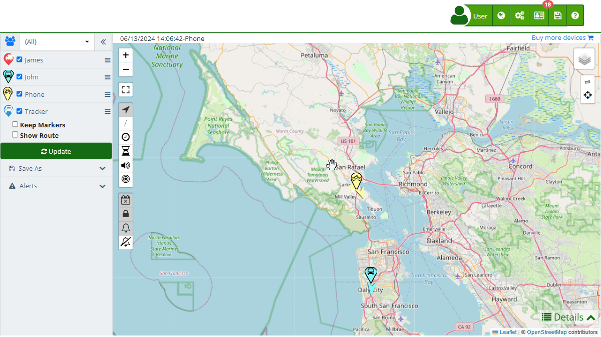

# Groups
The "[Groups](https://app.plaspy.com/Groups)" section in Plaspy allows users to efficiently organize their devices by grouping them according to different criteria. This facilitates management, monitoring, and assignment of access permissions to devices. Groups are a fundamental tool for maintaining an organized and controlled structure of tracked assets.

To access the groups section, go to the top menu and select "", then choose "[Groups](https://app.plaspy.com/Groups)". Here you can create new groups, edit existing ones, and assign devices to each group.

### Field Descriptions

- **Name:** Field to enter the group name, which should be descriptive and easy to identify.
- **Description:** Field to add a detailed description of the group, providing additional information about its purpose or content.
- **API ID:** Unique identifier of the group, used for integrations and queries through the API.
- **Insert into My Website:** HTML code provided to embed the group's [map on an external webpage](developers/embed_login_on_my_website/embed_the_map_on_my_website).
- **Members:** List of devices that belong to the group.
- **Device:** Search field to add devices to the group.

### Group Functionalities

Groups in Plaspy allow you to perform the following actions:

- **Filter on the Map:** View only the devices that belong to a specific group on the [map](https://app.plaspy.com/Map), facilitating visualization and monitoring.
- **Access Control:** Limit [user](https://app.plaspy.com/Users) and mobile device access to certain groups, improving security and permission management.
- **Organization:** Keep devices organized according to their location, function, or any other relevant criteria, improving management efficiency.

### Step-by-Step Instructions

**Creating a New Group**

1. **Access the Groups Section:**
    - Click on "" in the top menu and select "[Groups](https://app.plaspy.com/Groups)".
2. **Start Group Creation:**
    - Click on the "" icon in the bottom right corner to open the group creation form.
3. **Complete Group Details:**
    - **Name:** Enter the group name.
    - **Description:** Add a detailed description of the group.
    - **Devices:** Use the search field to add devices to the group.
4. **Save the Group:**
    - Click "OK" to save the new group.
    - If you wish to cancel, click "Cancel".

**Editing an Existing Group**

1. **Select the Group to Edit:**
    - In the list of [groups](https://app.plaspy.com/Groups), click on the edit icon \(\) next to the group you want to modify.
2. **Modify Group Details:**
    - Make the necessary changes to the group's name, description, or devices.
3. **Save Changes:**
    - Click "OK" to save the changes made.

### Validations and Restrictions

- **Group Name:** Make sure to enter a unique and descriptive group name.
- **Devices:** You must add at least one device to the group for it to be valid.

### Frequently Asked Questions

- **How can I add devices to a group?**
    - Use the search field in the group edit form to find and add devices to the group.
- **Can I assign a device to multiple groups?**
    - Yes, a device can belong to multiple groups, allowing you to organize it according to different criteria.
- **What if I want to delete a group?**
    - Click on the delete icon \(\) next to the group you want to delete. Confirm the deletion when prompted.
- **How can I view only the devices of a group on the map?**
    - Select the desired group in the [map](https://app.plaspy.com/Map) filter to view only the devices that belong to that group.
- **Is it possible to share a group with other users?**
    - Yes, you can set access permissions to share the group with other [users](https://app.plaspy.com/Users), allowing them to view and manage the group's devices.
