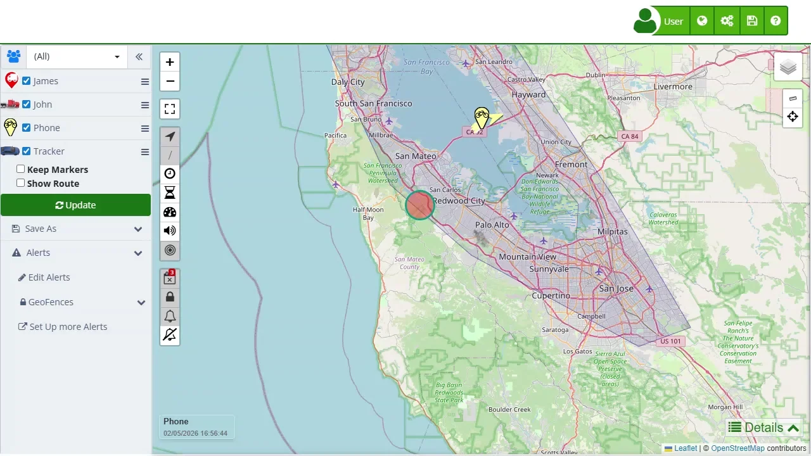

# Atributes
In Plaspy, each reported location can have various attributes that provide detailed information about the device's status and data at that specific moment. These attributes are not configurable by users, but understanding them is crucial for correctly interpreting the information provided by the tracking devices. It is important to note that the available attributes depend on each device and are additional to the standard attributes of each location. Not all devices have additional attributes, so all the attributes listed below may or may not be present in each location report.

It is important to note that additional attributes depend on the device used and may vary between location reports. Not all devices have the same attributes, and some reports may not include additional attributes. Understanding these attributes is essential for correctly interpreting the data provided and maximizing the use of the Plaspy platform. Although these attributes are not configurable by users, knowing them helps in better managing and analyzing the information collected by tracking devices.

| **Attribute** | **Description** |
| --- | --- |
| Event | Event triggered by the device |
| Status | Status of the device |
| Command | Command triggered by the device |
| Altitude | Altitude in meters |
| Mileage | Mileage reported by the device |
| RFID | RFID code |
| User | User logged on the device |
| Fuel2 | Fuel status sensor 2 |
| Temperature2 | Temperature from sensor 2 |
| Voltage | Voltage on the device |
| ADC1 | Sensor 1 Analog |
| ADC2 | Sensor 2 Analog |
| ADC3 | Sensor 3 Analog |
| ADC4 | Sensor 4 Analog |
| ADC5 | Sensor 5 Analog |
| ADC6 | Sensor 6 Analog |
| ADC7 | Sensor 7 Analog |
| ADC8 | Sensor 8 Analog |
| ADC9 | Sensor 9 Analog |
| ADC10 | Sensor 10 Analog |
| ADC11 | Sensor 11 Analog |
| ADC12 | Sensor 12 Analog |
| ADC13 | Sensor 13 Analog |
| ADC14 | Sensor 14 Analog |
| ADC15 | Sensor 15 Analog |
| ADC16 | Sensor 16 Analog |
| Input | Input status |
| IO1 | Input and output 1 status |
| IO2 | Input and output 2 status |
| IO3 | Input and output 3 status |
| IO4 | Input and output 4 status |
| Output | Output status |
| Counter | Device Counter |
| Counter1 | Device Counter 1 |
| Counter2 | Device Counter 2 |
| Counter3 | Device Counter 3 |
| Counter4 | Device Counter 4 |
| HDOP | Horizontal Dilution of Precision [https://en.wikipedia.org/wiki/Dilution_of_precision_\(navigation\)](https://en.wikipedia.org/wiki/Dilution_of_precision_%28navigation%29) |
| PDOP | Position Dilution of Precision [https://en.wikipedia.org/wiki/Dilution_of_precision_\(navigation\)](https://en.wikipedia.org/wiki/Dilution_of_precision_%28navigation%29) |
| VDOP | Vertical Dilution of Precision [https://en.wikipedia.org/wiki/Dilution_of_precision_\(navigation\)](https://en.wikipedia.org/wiki/Dilution_of_precision_%28navigation%29) |
| Satellites | Number of satellites connected |
| GSM | GMS signal |
| GPS | GPS signal |
| Signal | Signal on device |
| MCC | Mobile Country Code [https://en.wikipedia.org/wiki/Mobile_country_code](https://en.wikipedia.org/wiki/Mobile_country_code) |
| MNC | Mobile Network Code [https://en.wikipedia.org/wiki/Mobile_country_code](https://en.wikipedia.org/wiki/Mobile_country_code) |
| LAC | Location Area Code [https://en.wikipedia.org/wiki/Location_area_identity](https://en.wikipedia.org/wiki/Location_area_identity) |
| CID | Mobile Cell ID |
| Cell | Mobile Cell ID |
| Charge | Charge voltage |
| API | Device API number |
| Type | Type of event |
| Index | Index of report |
| Serial | Serial of report |
| Power | Power supply Voltage |
| Battery | Batter Voltage |
| Alarm | Alarm triggered |
| Archive | Data Archive |
| Code | Code of event |
| Flags | Flags of event |
| Valid | Location Validity |
| Steps | Number of steps traveled |
| ADC0 | Sensor 1 Analog |
| ODate | Original date submitted by the device |
