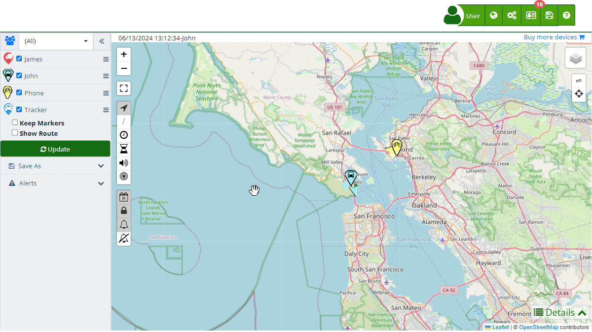

# Bulk Alert Editing
The bulk alert editing function in the [map](https://app.plaspy.com/Map) allows users to configure and manage alerts for multiple devices simultaneously. This tool is especially useful for making batch adjustments, saving time, and ensuring consistency in alert configurations across several devices. However, due to its capacity to modify multiple devices at once, it is important to use this function with caution to avoid errors that could affect device operations.

## General Description

The option to edit alerts is located at the bottom of the map control panel, under the "*fa-exclamation-triangle* Alerts" section. By selecting multiple devices, you can access the alert editing window, where you can add new alerts or replace existing alerts on all selected devices.

### How to Access and Use the Alert Editing Function

1. **Access Alert Editing**:
    - Log in to your account.
    - Navigate to the main [map](https://app.plaspy.com/Map) where all your devices are displayed.
    - In the left panel, under the "*fa-exclamation-triangle* Alerts" section, click on "*fa-pencil* Edit Alerts".
2. **Select Devices**:
    - In the control panel, select the devices for which you want to configure or edit alerts. The selected devices will be listed at the top of the alert editing window.
3. **Add or Replace Alerts**:
    - **Add**: This option allows you to add new [alerts](../devices/alerts) to the selected devices without deleting existing alerts. Useful when you want to add additional alerts while maintaining current configurations.
    - **Replace**: This option deletes all current alerts on the selected devices and adds the new configured alerts. Use this option with caution, as all existing alerts will be lost.

### Detailed Steps to Configure Alerts

1. **Add New Alerts**:
    - Click the "*fa-plus*" button to add a new [alert](../devices/alerts).
    - Configure the alert parameters according to your needs \(e.g., geofence, speed, idle time, etc.\).
    - Once the alert is configured, click "Ok". The new alert will be added to all selected devices.
2. **Replace Existing Alerts**:
    - Click the "*fa-plus*" button to add the new alert.
    - Configure the alert parameters according to your needs.
    - Select "ok" to delete all current alerts and add the new alerts to the selected devices.

### Precautions and Recommendations

- **Caution with Replacing Alerts**: The replace option is powerful but dangerous, as it will delete all existing alerts on the selected devices. Ensure you carefully review the new alerts before applying them.
- **Review Configurations**: Always review the configurations of the new or edited alerts to ensure they align with the operational requirements of your devices.
- **Confirm Selected Devices**: Verify that the devices selected for alert editing are the correct ones, avoiding unintended modifications to other devices.

## Example Use Case

Suppose a fleet manager needs to set up a new geofence alert for all vehicles operating in a specific area. Instead of configuring this alert on each device individually, the manager can select all relevant vehicles, access the "*fa-pencil* Edit Alerts" option, configure the new geofence, and apply the alert to all selected devices at once. If the existing alerts also need updating, the manager can use the "Replace" option to ensure that only the most recent and relevant alerts are active on the devices.

This bulk editing function is a powerful tool for the efficient management of alerts across multiple devices, allowing users to save time and ensure consistency in their tracking system configurations.
