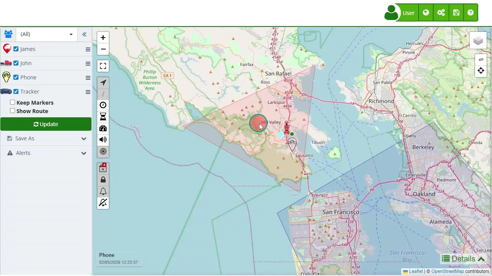

# Buttons on the Map
The [map](https://app.plaspy.com/Map) interface in Plaspy is equipped with a variety of icons and controls that allow users to interact and customize their device monitoring experience effectively. These icons are strategically located around the map to facilitate access to key functions, such as zoom control, route visualization, and the management of alerts and geofences. Each button is designed to provide a specific functionality that enhances users' ability to accurately and detailedly track their devices in real-time. By familiarizing themselves with these icons, users can maximize the use of available tools to analyze movements, optimize routes, and respond quickly to critical events.

Efficient use of these buttons allows users to quickly adjust the map view, focus on new events, and obtain detailed information about device activity. From the ability to zoom in and out for better visualization to the option of switching between different base map types, each icon has a purpose that contributes to more effective monitoring and informed decision-making. The icons also offer advanced functionalities such as clustering nearby points, activating auditory alerts, and measuring distances, all of which facilitate comprehensive and dynamic management of tracking operations.

#### *fa-plus* Zoom In

Allows zooming in on the map view for a detailed inspection of a specific region. This is useful when needing to examine the exact location of devices in a small area, for instance, to monitor the precise position of a vehicle within a parking lot.

#### *fa-minus* Zoom Out

Allows zooming out on the map view to get a broader perspective. Ideal for obtaining an overview of the distribution of all tracked devices in a larger region, such as a city or metropolitan area, facilitating the management of dispersed fleets.

#### **** Full-Screen View

Maximizes the map to occupy the entire device screen, providing an immersive viewing experience. This is especially useful in control and monitoring environments where having a clear, distraction-free view of all activities on the map is crucial.

#### *fa-location-arrow* Heading

Shows the direction the device is heading, which is essential for understanding the trajectory and predicting the future route. It is useful in situations where continuous monitoring of a vehicle or person's movement is needed, such as in logistics or security operations.

#### ***/*** Trail

Allows displaying or hiding the historical trail of a device, showing its past route. This is useful for analyzing historical movements, detecting movement patterns, and reviewing completed routes to optimize future route planning.

#### *fa-clock-o* Show Device Idle Time on Marker

Displays the time a device has been stationary, helping to identify periods of inactivity. This information is crucial for detecting potential issues or verifying that vehicles are not being misused.

#### *fa-hourglass-half* Show Idling Time on Marker

Indicates how long the device has been on but not significantly moving. This is useful for assessing vehicle usage efficiency and identifying opportunities to reduce operational costs by minimizing idling time.

#### *fa-volume-up* Activate Sound

Activates auditory notifications for specific alerts or events. This is essential in environments where immediate notification of certain critical events, such as entering or leaving a geofence, is needed.

#### *fa-bullseye* Auto-Focus on New Markers

Automatically centers the map view on new devices that appear, ensuring new elements entering the monitored area are not overlooked. This is particularly useful in dynamic environments where new devices are frequently added.

#### *fa-object-group* Cluster Nearby Points

Visually clusters devices that are very close to each other to improve visibility and facilitate counting. This is especially useful in areas with high device density, such as large parking lots or mass events.

#### *fa-reply-all* Show All Markers

Displays all markers of a device's complete route. Usually, only the last route marker is shown, but this option allows viewing all route points, useful for detailed analysis and route audits.

#### *fa-calendar-times-o* Show Offline Devices

Highlights devices that have lost connectivity, allowing quick identification of connection issues. This facilitates rapid technical problem resolution and ensures all devices are operational.

#### *fa-lock* Hide Restricted, Allowed, and Control Zones

Manages the visibility of geofences on the map, hiding or showing specific zones as needed. This helps maintain a cleaner map view or focus on particular areas of interest.

#### *fa-bell-o* Show/Hide Critical Alerts

Manages the display of critical alerts, ensuring users are informed about important events requiring immediate attention. This is crucial for maintaining safety and efficiency in monitoring.

#### *fa-bell-slash-o* Stop and Dismiss Critical Alerts

Allows stopping and dismissing critical alerts that have already been attended to or do not require further attention, keeping the alert system clean and relevant. This ensures that only current and pertinent alerts are visible.

#### **** Change Map Type

Allows selecting between different base map types, such as OpenStreetMaps, Google Maps, Open SeaMaps, Apple Maps, etc. This functionality is useful to adapt to user viewing preferences or to use more detailed maps depending on the region.

#### **** Measure Distance

Allows measuring the distance between two points on the map, facilitating route planning and geographical analysis. It is essential for calculating precise distances and evaluating the feasibility of certain routes.

#### *fa-crosshairs* Find Nearby Device

Helps quickly locate the nearest device to a specific location on the map. This is useful for search and rescue operations or for efficiently assigning resources based on proximity.
