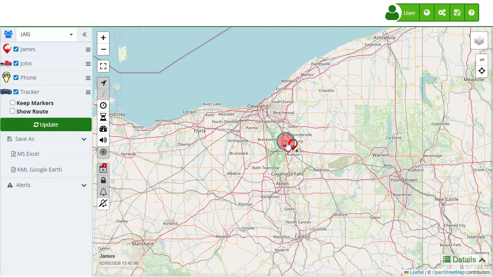

# Detailed Device Information
When you click on a marker on the [map](https://app.plaspy.com/Map), a popup window appears displaying detailed information about the device's location and status. This popup provides critical data that helps users monitor and efficiently manage each device. The information shown may vary depending on the tracker's capabilities. Below is a description of each section of the information provided in the marker.

### General Information

- **Device Name:** Displays the device's name at the top of the popup, such as "403". This allows for quick and clear identification of the selected device.
- **Date and Time:** Displays the date and time of the last update received from the device, such as "05/31/2024 06:02:51". This helps verify the currency of the information.

### Monitoring Data

- **Current Location:** Shows the approximate address where the device is located, like "1234 Maple Street". This information is useful for understanding the exact position of the device in easily understandable terms.
- **Speed:** The current speed of the device is shown next to the date and time, for example, "0 Mi/h". This is crucial for understanding whether the device is moving or stationary.
- **Battery Level:** A battery indicator shows the device's charge level, such as "100%". This is essential for ensuring the device has enough power to continue operating.
- **Mileage:** The total distance traveled by the device, for example, "0 Km", helps monitor the device's usage and performance.
- **Movement Status:** The time the device has been stationary, for instance, "Stationary 13:11:54", helps identify prolonged periods of inactivity.

### Interactive Options

- **Digital Inputs:** Allows expanding to view details about the device's digital inputs, such as activated sensors. This is useful for getting additional information on the device's status and functionality.
- **Share Location:** Provides options to share the device's location via different platforms like Google Maps, Waze, and WhatsApp. This feature is ideal for coordinating actions and sharing location information with others.
- **[Attributes](atributes):** Displays additional technical details such as the device's latitude and longitude, which can be clicked to open in Google Maps. These precise geospatial data points are useful for detailed analysis and specific actions.
- **Approximate Street View:** A link to open the approximate street view using Google Street View, providing a visual perspective of the device's surroundings.
- **Send Command:** Allows sending commands to the device directly from the popup, facilitating immediate remote actions like restarting the device or sending specific alerts.

### Additional Device Information

- **Fuel Level:** If available, shows the device's fuel level, for example, "93%". This is useful for fleet management and refueling planning.
- **Temperature:** If the device has temperature sensors, it shows the current reading, useful for monitoring environmental conditions in refrigerated vehicles.
- **RPM and Battery Voltage:** For advanced devices, it may display engine RPM and battery voltage data, essential for maintenance and performance monitoring.
- **GSM Signal:** Shows the GSM signal quality as a percentage, ensuring the device has a good connection for data transmission.

### Example Use Case

Suppose a fleet manager needs to check the real-time location and status of a specific vehicle. By clicking on the vehicle's marker on the map, the manager can immediately see details such as the last known location, current speed, battery level, and other important data. If the vehicle has been stationary for an extended period, the manager can decide to send a command to investigate further or take corrective action. Additionally, the manager can share the vehicle's location with a roadside assistance team using the share location feature, ensuring a quick and efficient response.

This detailed information popup is a powerful tool for efficient device management, providing crucial data and interactive options that facilitate immediate decision-making and action.
