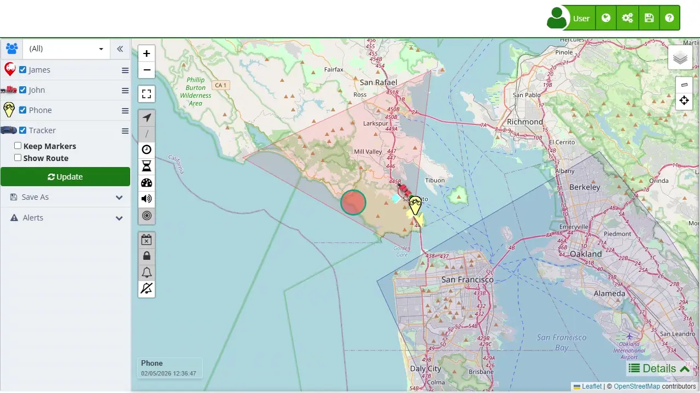

# Details
The [map](https://app.plaspy.com/Map) details section provides a comprehensive and detailed view of the information of tracked devices. This functionality is essential for users who need to monitor and analyze specific data of their devices in real time. The interface is designed to display critical information, such as speed, battery level, mileage, and other relevant data, in an easy-to-understand tabular format. Below, the main components and functionalities of this section are detailed.

## General Description

The map details section is located at the bottom of the map interface and is organized into a table listing each device along with its corresponding metrics. This table allows users to filter and sort data according to their specific needs. By clicking on a device in the table, the map can be centered on the location of that device, providing seamless integration between the map visualization and the details table.

This functionality is particularly useful for fleet management and monitoring moving assets, as it allows users to quickly and efficiently obtain accurate and up-to-date information. The table includes various columns covering key aspects of device performance and status, enabling users to easily identify any potential issues and make informed decisions based on real-time data.

## Table Fields Description

**Device Name** This field displays the name assigned to each device, allowing for quick and easy identification in the list. It is useful for selecting and centering the map on a specific device.

**Date** The date column indicates the last update received from the device. This helps users verify the recency of the information and detect any delays in reporting.

**Speed \(Mi/h\)** Shows the current speed of the device in kilometers per hour. It is essential for monitoring movement and assessing if the device is moving within expected limits.

**Battery \(%\)** This field shows the device's battery level as a percentage. It is crucial to ensure that devices have enough power to continue reportin g their location and other data.

**Mileage \(Mi\)** Indicates the total kilometers traveled by the device. This information is useful for maintenance planning and evaluating the usage of the tracked vehicle or asset.

**Idle Time** Displays how long the device has been idle. It is important for identifying prolonged periods of inactivity and optimizing resource utilization.

**Fuel \(%\)** Shows the fuel level of the device as a percentage, if available. This information is valuable for fleet management and refueling planning.

**Sensor 1** Provides specific data from the additional sensor configured on the device. This column can show varied information depending on the type of sensor used.

**Address** Indicates the current or last known address of the device, providing a precise geographical reference of its location.

**Zone** Shows the geographical zone where the device is located, which is useful for geofence management and route planning.

**Alarm** This column displays any alarms or critical events reported by the device, alerting users to situations that require immediate attention.

## Step-by-Step Instructions

### How to Filter and Sort Data

1. **Filter Data:** Use the filter field to search for specific devices or data within the table. Type in relevant keywords and the table will automatically update to show only the rows that match the search criteria.
2. **Sort Columns:** Click on the header of any column to sort the data in ascending or descending order. This allows you to organize the information in a way that suits your monitoring needs.

### How to View Device Details

1. **Select Device:** Click on the row of the device you want to inspect. This will center the map on the location of the selected device, providing a detailed view of its position.
2. **Analyze Data:** Review the metrics presented in the table to gain a comprehensive understanding of the device's status and performance. Use this information to make informed decisions about managing the device.

## Validations and Restrictions

- **Data Recency:** Ensure that the data displayed is up to date. The date of the last update can help verify this.
- **Sensor Availability:** Not all devices may have additional sensors configured. Check the device specifications to understand what data will be available.
- **Filters and Sorting:** Use filters and sorting to manage large amounts of data efficiently and quickly find the necessary information.

## Frequently Asked Questions

- **How can I tell if a device is offline?**
 - The alarms column can indicate if a device is offline. Additionally, you can use the filter field to specifically search for offline devices.
- **What should I do if a device shows incorrect data?**
 - Check the date of the last update to ensure that the data is recent. If the problem persists, consider physically checking the device or contacting technical support.
- **Can I export the data from the table?**
 - Yes, the details section allows data export for further analysis. Check the export options in the interface menu for more details.

This map details section is a powerful tool for efficient monitoring and management of tracked devices, providing critical and real-time information to support informed decision-making and maintain smooth operations.
